# UI/UX Architecture: WireTuner
**Status:** UI_REQUIRED

<!-- anchor: section-1 -->
## 1. Design System Specification
WireTuner is a professional-grade desktop vector environment. The design system must balance dense information, precision tooling, and high-contrast event telemetry overlays while remaining accessible on macOS and Windows. All tokens are exposed through a centralized `DesignTokenRegistry` service that syncs with the Flutter theme layer and persists to JSON for plugin parity.

<!-- anchor: section-1-1 -->
### 1.1 Color Palette
The palette is optimized for dark-default UI chrome with light-friendly canvas and artboard surfaces. Semantic tokens support event replay overlays, sampling diagnostics, and collaboration presence.

- **Foundational Surface Colors**
  - `Surface/Base` — #0D1015. Used for primary window chrome, Navigator background, and inactive tool docks. 13.8:1 contrast against primary text.
  - `Surface/Raised` — #141920. Elevated panels such as Inspector and Layer stacks. 11.1:1 contrast.
  - `Surface/Overlay` — #1C222C at 88% opacity. Modal scrims, quick actions, toast backgrounds.
- **Canvas & Artboard Neutral Colors**
  - `Canvas/Infinite` — #1A1D22, gradient tinted to guide focus without moiré artifacts at high zoom.
  - `Artboard/Default` — #F7F8FA with #E1E3E8 border to provide crisp separation against dark chrome.
  - `Viewport/Grid` — #3A3F49 60% for minor grid, #4F5562 90% for major grid intersections.
- **Primary Interaction Colors**
  - `Accent/Primary` — #4FB2FF. Buttons, tool activation indicator, active tab highlight, event scrubber.
  - `Accent/Secondary` — #6F7CFF. Secondary actions, sampling toggle, collaboration presence rings when user idle.
  - `Accent/Tertiary` — #5CFFCE. Positive reinforcement, successful exports, saved state.
- **Semantic Alerts**
  - `Semantic/Warning` — #FFB347 for destructive previews, disk space warnings.
  - `Semantic/Error` — #FF5C73 for failed exports, corrupted files, OT conflicts.
  - `Semantic/Info` — #53D3FF for guidance toasts (e.g., intelligent zoom suggestions), built-in help overlays.
- **Anchor Visualization Colors**
  - `Anchor/Smooth` — #FF5C5C fill with #080A0E stroke.
  - `Anchor/Corner` — #080A0E fill with #F7F8FA stroke.
  - `Anchor/Tangent` — #FFA345 fill with #080A0E stroke.
- **Collaboration Presence Colors** (cycled palette to handle 10+ participants)
  - `Presence/1` #FF9BAE, `Presence/2` #FFD66F, `Presence/3` #5DFFB1, `Presence/4` #7FE2FF, `Presence/5` #B18CFF, `Presence/6` #FF7F5E, `Presence/7` #6FE5FF, `Presence/8` #9FED72, `Presence/9` #FFCFEC, `Presence/10` #8DF0FF.
- **Data Visualization Gradient Bands**
  - Performance heatmaps use #1D91F0 ➝ #70F1C6 ➝ #F8EB6B to depict sampling density.
  - Event category overlays use #FF6F91 (path), #FFC75F (selection), #9CFFFA (viewport), #C087F9 (document) to align with event logs.
- **Contrast Policy**
  - All interactive text or iconography must meet ≥4.5:1 contrast on `Surface/Base`. Use automatic fallback to `Accent/Tertiary` when color-coded semantic fails due to user-set high-contrast theme.

`DesignTokenRegistry` excerpt:

```yaml
tokens:
  surface:
    base:
      value: "#0D1015"
      usage: ["window.chrome", "dock.background", "navigator"]
      contrast: "13.8:1 vs text/primary"
    raised:
      value: "#141920"
      usage: ["inspector.panel", "timeline.toolbar"]
      contrast: "11.1:1 vs text/primary"
    overlay:
      value: "rgba(28,34,44,0.88)"
      usage: ["modals", "context.menu"]
      notes: "applies blur(8px) on macOS only"
  canvas:
    infinite:
      value: "#1A1D22"
      usage: ["root.viewport"]
    artboard-default:
      value: "#F7F8FA"
      usage: ["artboard.fill"]
      border: "#E1E3E8"
  accent:
    primary:
      value: "#4FB2FF"
      hover: "#6DC2FF"
      pressed: "#3D94D6"
      focus-ring: "#87D2FF"
    secondary:
      value: "#6F7CFF"
      hover: "#93A1FF"
    tertiary:
      value: "#5CFFCE"
      usage: ["success.badge", "snapshot-toast"]
  semantic:
    warning:
      value: "#FFB347"
      on_color: "#0D1015"
    error:
      value: "#FF5C73"
      on_color: "#0D1015"
    info:
      value: "#53D3FF"
      on_color: "#0D1015"
  anchor:
    smooth:
      fill: "#FF5C5C"
      stroke: "#080A0E"
      radius_px: 5
    corner:
      fill: "#080A0E"
      stroke: "#F7F8FA"
      size_px: 7
    tangent:
      fill: "#FFA345"
      stroke: "#080A0E"
      size_px: 7
  presence:
    palette:
      - "#FF9BAE"
      - "#FFD66F"
      - "#5DFFB1"
      - "#7FE2FF"
      - "#B18CFF"
      - "#FF7F5E"
      - "#6FE5FF"
      - "#9FED72"
      - "#FFCFEC"
      - "#8DF0FF"
  overlays:
    selection:
      fill: "rgba(79,178,255,0.08)"
      stroke: "rgba(79,178,255,0.6)"
    marquee:
      dash: "6 4"
      stroke: "rgba(111,124,255,0.9)"
  grid:
    minor:
      value: "rgba(58,63,73,0.6)"
    major:
      value: "rgba(79,85,98,0.9)"
  focus:
    default:
      outer: "#4FB2FF"
      inner: "#0D1015"
      width_px: 2
  metrics-overlay:
    fps:
      idle: "#5CFFCE"
      warning: "#FFB347"
      error: "#FF5C73"
```

<!-- anchor: section-1-2 -->
### 1.2 Typography
WireTuner uses IBM Plex Sans (UI copy) and IBM Plex Mono (code snippets, coordinate readouts). Typography is tuned for dense interfaces with short line-lengths.

| Token | Font | Size | Line Height | Usage |
| --- | --- | --- | --- | --- |
| `type/xxs` | Plex Sans | 10px | 14px | Metadata badges, tooltip footers |
| `type/xs` | Plex Sans | 12px | 16px | Secondary labels, Navigator counts |
| `type/sm` | Plex Sans | 13px | 18px | Layer list, artboard names |
| `type/md` | Plex Sans | 14px | 20px | Inspector labels, status bar |
| `type/lg` | Plex Sans | 16px | 22px | Window titles, major callouts |
| `type/xl` | Plex Sans SemiBold | 20px | 26px | Top-level section headers |
| `type/2xl` | Plex Sans SemiBold | 24px | 30px | Onboarding panels, marketing modals |
| `type/mono-sm` | Plex Mono | 12px | 16px | Coordinate readouts, event log sequences |
| `type/mono-md` | Plex Mono | 14px | 20px | Sampling inspector, JSON viewer |

Typography guidance:

1. Keep line lengths under 64 characters within inspector panels to maintain scannability.
2. Monospaced coordinates always display trailing zeros to enforce precision (e.g., `123.400 px`).
3. When localization expands strings, dynamic truncation adds ellipsis plus tooltip for full text.
4. Artboard Navigator names wrap to two lines for long device names; third line clamps with gradient mask.
5. System-level dialogues on macOS/Windows adopt native fonts but share size tokens to maintain rhythm.

<!-- anchor: section-1-3 -->
### 1.3 Spacing & Sizing Scale
Spacing uses a 4px baseline grid to align anchors, overlays, and inspector controls. Larger panels rely on multiples of 8px to sync with artboard gutters.

- `space/2` = 2px micro gaps for icon stacking.
- `space/4` = 4px default gap between icon and label inside toolbar buttons.
- `space/6` = 6px used for dense table rows (event log).
- `space/8` = 8px applied across inspector field groups, toast padding, and inline error callouts.
- `space/12` = 12px for card-level padding (Navigator thumbnails, sampling cards).
- `space/16` = 16px baseline margin for windows and modals.
- `space/20` = 20px needed for artboard boundary gutters at 100% zoom.
- `space/24` = 24px cross-panel spacing between docked columns.
- `space/32` = 32px for onboarding hero sections or empty state illustrations.
- `space/48` = 48px for large-scale marketing overlays, rarely used in production editing flows.

Sizing tokens include:

- `size/button/compact`: 28px height, 8px horizontal padding.
- `size/button/default`: 32px height, 12px horizontal padding.
- `size/input/slot`: 36px height, 12px padding, icon slot width 20px.
- `size/icon/sm`: 12px, `size/icon/md`: 16px, `size/icon/lg`: 20px, `size/icon/xl`: 32px (tool previews, history timeline, artboard thumbnails overlays).
- `size/thumbnail/sm`: 120x90, `size/thumbnail/lg`: 208x156; renders at 2x scale on retina displays.
- `size/focus-ring`: 2px outer highlight, 1px inner border for dark surfaces.

<!-- anchor: section-1-4 -->
### 1.4 Component Tokens
Component tokens ensure consistent behavior across Flutter widgets.

| Token | Description |
| --- | --- |
| `radius/sm = 4px` | Tool buttons, context menus |
| `radius/md = 8px` | Floating panels, Navigator cards |
| `radius/lg = 12px` | Dialogs, onboarding hero cards |
| `shadow/xs` | `0 1px 2px rgba(0,0,0,0.32)` for toolbar elevation |
| `shadow/sm` | `0 4px 16px rgba(0,0,0,0.28)` modals |
| `shadow/md` | `0 12px 32px rgba(0,0,0,0.4)` for command palette |
| `transition/fast` | 120ms ease-out for toggles |
| `transition/medium` | 200ms ease-in-out for overlays |
| `transition/slow` | 320ms ease for onboarding carousels |
| `blur/background` | 14px backdrop blur for macOS vibrancy |
| `stroke/hairline` | 0.5px device pixel ratio aware strokes |
| `stroke/standard` | 1px for panel dividers |
| `stroke/emphasis` | 2px for focus rings and selection outlines |
| `opacity/disabled` | 48% for icons, 60% for text |
| `opacity/ghost` | 12% overlay for hover states |
| `opacity/scrim` | 64% baseline for modal scrims |

<!-- anchor: section-1-5 -->
### 1.5 Iconography & Glyph System
- Base iconography derived from a custom 16px grid to maintain crispness on retina and standard displays.
- Tool icons are line-based with 2px strokes; fill icons reserved for destructive actions or status.
- Collaboration presence icons overlay colored rings plus trailing pointer ghost to show sampling trails.
- Cursor icons prioritized: crosshair (Pen), white arrow (Selection), hollow arrow (Direct Selection), hand (Pan), target reticle (Anchor toggle), multi-caret (multiplayer presence), and spinner (snapshot in progress) with transitions under 150ms.
- Icon tokens exported via Figma component sets and compiled into a Flutter icon font for performance; fallback to vector assets for Windows high-contrast mode.

<!-- anchor: section-1-6 -->
### 1.6 Motion & Micro-interactions
- Tool activation ripple: 160ms scale-up with 0.9 overshoot, tinted by active tool color.
- Anchor visibility toggle: icon rotates 120° per mode change, with color-coded highlight matching resulting mode.
- Navigator thumbnail refresh indicator: spinner arcs segmented into artboard color-coded segments, takes 900ms full spin.
- Event timeline scrubber: inertial flick with velocity-based deceleration; when hitting checkpoints, subtle magnet effect (ease-out 220ms) communicates snapshot anchor.
- Collaboration cursors: trailing fade lasting 300ms to depict direction; when a collaborator selects an object, highlight ring pulses between 80% and 100% scale.

<!-- anchor: section-1-7 -->
### 1.7 Data Visualization & Diagnostic Tokens
- FPS overlay uses stacked bars (green ≤16ms, amber 17-33ms, red >33ms) with gradient fill and numeric labels using Plex Mono.
- Event sampling heatmap overlays: grid of 64x64 cells, each cell uses gradient scale (#132A3A → #4FB2FF → #F05C91). Tooltips show sample count, average delta.
- Undo/redo queue inspector: timeline nodes tinted by tool category; hovered nodes expand to show operation metadata.
- Export diagnostics panel: uses severity icons, row backgrounds tinted by semantic color at 8% opacity; warns remain on screen until dismissed.

<!-- anchor: section-1-8 -->
### 1.8 Accessibility Guardrails within Design System
- Provide `HighContrast` theme variant toggled automatically based on OS-level preferences; ensures `Surface/Base` becomes #030407 and `Accent/Primary` shifts to #34C3FF.
- Font scaling: support OS scaling from 0.9× to 1.4× without truncation by employing flexible layout wrappers and measuring text baselines before rendering overlay controls.
- Hit targets: minimum 40x40px for toolbar icons; anchors expand on hover to 44px bounding area for pointer tolerance.
- Keyboard focus states: every interactive element uses `focus-ring` token with additional icon highlight to handle cases where ring is partially off-canvas.
- Animations: reduce motion preference short-circuits timeline scrubbing inertia, disables icon rotations, and substitutes fade transitions.

<!-- anchor: section-2 -->
## 2. Component Architecture
The UI follows an Atomic Design interpretation tuned for Flutter. Atoms expose design tokens; molecules encapsulate tool-specific interactions; organisms and templates orchestrate multi-panel workflows. Component contracts enforce immutability and Provider-based data injection, ensuring deterministic undo/redo.

<!-- anchor: section-2-1 -->
### 2.1 Overview & Methodology
- **Atomic Foundation:** Colors, typography, spacing, and icons compile into Theme extensions consumed by Flutter widgets. Each Atom is a stateless widget referencing tokens.
- **Tooling-specific Molecules:** Compose icons, toggles, and overlays to represent Pen, Direct Selection, Navigator cards, etc. Each molecule accepts context objects (document ID, artboard metadata) but defers mutation to InteractionEngine.
- **Organisms & Layout Templates:** Multi-panel windows, Navigator, Inspector, Layer stack, Timeline. They manage state subscription boundaries to avoid unnecessary repainting and coordinate virtualization for large datasets.
- **Layered Responsiveness:** Because desktop windows are resizable, each component exposes size classes (`compact`, `regular`, `expanded`) to reorganize controls without losing discoverability.
- **Accessibility-first Contracts:** Every component defines `semanticLabel`, focus order, and `ShortcutIntent` mapping for keyboard parity.

<!-- anchor: section-2-2 -->
### 2.2 Core Component Specifications
#### Atoms (Visual Primitives)
- **TokenColorSwatchAtom**
  - Purpose: Visualize palette entries within Settings.
  - Props: `tokenName`, `hexValue`, `usageExamples`.
  - States: default, selected for editing, warning when contrast fails.
  - A11y: Announces token name, contrast ratio, and usage via screen reader.
- **GlyphButtonAtom**
  - Purpose: Icon-only button for toolbars.
  - Props: `icon`, `tooltip`, `isToggle`, `shortcut`.
  - States: default, hover, focus, pressed, disabled.
  - A11y: `Semantics(button, toggled state)`, ensures 44px hit target.
- **TextLabelAtom**
  - Purpose: Standardized text widget with dynamic scaling.
  - Props: `token`, `maxLines`, `overflowBehavior`.
  - Behavior: Observes OS scaling and updates `TextPainter` caches.
- **BadgeAtom**
  - Purpose: Display counts (events, collaborators).
  - Props: `value`, `severity`, `maxDigits`.
  - Visual: color-coded backgrounds referencing semantic tokens.
- **TooltipAtom**
  - Purpose: Provide consistent informative overlays with keyboard hints.
  - Behavior: 120ms delay, arrow pointer, automatic screen-edge repositioning.
- **DividerAtom**
  - Purpose: hairline or 1px dividers between panel sections.
  - Props: `orientation`, `inset`, `style` (solid/dashed).
- **FocusHaloAtom**
  - Purpose: Reusable focus ring overlay supporting custom shapes.
  - Props: `targetRect`, `radiusToken`, `colorToken`.
- **PresenceDotAtom**
  - Purpose: Show collaborator presence in avatars or layer list.
  - Props: `color`, `status`, `latency`.

#### Control Molecules
- **ToolToggleButton**
  - Composition: GlyphButtonAtom + label.
  - Props: `toolId`, `shortcut`, `latchingBehavior`.
  - States: default, latched, locked (when tool disabled by context).
  - Accessibility: announces tool purpose and shortcut.
- **SegmentedToolSwitch**
  - Purpose: switch between Selection, Direct Selection, Group tools.
  - Behavior: supports pointer + keyboard arrow navigation, roving tabindex.
- **AnchorVisibilityToggle**
  - Composition: icon, text label, mode indicator.
  - Modes: All, Selected, Hidden; cycles with Cmd/Ctrl+Shift+A.
  - Interaction: rotates icon, updates tooltip, triggers toast.
- **SamplingRateSlider**
  - Props: `value`, `min`, `max`, `presetLabels`.
  - Behavior: shows predicted storage impact, binds to SettingsService.
- **GridSnapSwitch**
  - Toggle with nested dropdown for grid density; watchers for intelligent zoom suggestions.
- **ColorSwatchPicker**
  - Dual-mode: quick swatch grid + advanced color editor.
  - Includes eyedropper micro-interaction with real-time preview bubble.
- **NumericStepper**
  - Supports fine (0.1) and coarse (10) increments with Shift modifiers.
  - Maintains internal `BigInt` to avoid floating rounding when editing high-precision transforms.
- **DropdownMenu**
  - Uses virtualization for large artboard lists; type-ahead search; arrow navigation.
- **ContextMenu**
  - Multi-level, includes iconography, shortcuts, destructive state, and context-specific disablement.

#### Data Input & Inspector Molecules
- **CoordinateFieldPair**
  - Pairs `X` and `Y` fields with lock/unlock to maintain constraints.
  - Accepts world or screen units; displays conversions inline.
- **TransformMatrixEditor**
  - Matrix grid with direct editing, decompresses to translation/scale/rotation fields.
  - Visual preview shows bounding box pre/post transform.
- **StrokeControlGroup**
  - Fields: color, width, cap, join, dash pattern.
  - Contains quick presets and preview lane.
- **FillControlGroup**
  - Supports solid, gradient, pattern; gradient editor with draggable stops, easing control.
- **OpacitySlider**
  - Horizontal slider with numeric field, allows typing `%` or decimals.
- **BlendModeSelector**
  - Grid with preview thumbnails; tooltip explains effect.
- **LayerVisibilityLockRow**
  - Combined visibility toggle, lock toggle, and rename inline editor.
- **MetadataPanel**
  - Shows document info, sampling intervals, file version, custom fields.

#### Data Display Organisms
- **NavigatorGrid**
  - Virtualized grid supporting up to 1000 artboards.
  - Each cell: thumbnail, title, dimensions, modified indicator, context menu trigger.
  - Supports drag-reorder with drop indicator, multi-select for bulk actions.
- **LayerTree**
  - Tree view with virtualization, multi-select, filtering, search.
  - Displays per-layer icons for mask, clipping, locked state.
- **HistoryTimeline**
  - Horizontal timeline with operation chips and event density sparkline.
  - Provides scrubber, play controls, speed slider, marker annotations.
- **EventLogList**
  - Tabular view of events, filter by type, user, timestamp.
  - Each row reveals JSON payload on expansion.
- **PerformanceOverlay**
  - Dockable panel showing FPS, event throughput, snapshot durations.
- **SamplingDiagnosticsPanel**
  - Heatmap view plus slider to navigate sampling windows.
- **CollaborationPresencePanel**
  - Shows avatars, editing artboard, network latency, microphone mute for future voice features.
- **ExportQueueMonitor**
  - Lists pending/completed exports with status badges, retry options.

#### Navigation & Window Chrome
- **ApplicationMenuBar** (platform-specific variations) with file, edit, object, view, window, help menus.
- **NavigatorTabs**
  - Document tabs with close buttons, dirty indicators, path tooltips.
- **SidebarDock**
  - Collapsible area hosting Navigator, Layers, History, etc.
- **StatusBar**
  - Left: document status, center: undo/redo cues, right: sampling indicator, selection size, zoom controls.
- **CommandPalette**
  - Searchable action interface triggered by Cmd/Ctrl+K; uses fuzzy matching, command categories, previews.

#### Overlay & Feedback Components
- **ToastStack**
  - Non-blocking notifications with queueing, anchored bottom-right.
- **ModalDialog**
  - Standard template for confirmations, multi-step flows.
- **ContextualCoachMarks**
  - Sequence overlays for onboarding, highlight components, linking to docs.
- **SelectionOverlay**
  - Renders bounding boxes, anchor handles, measurement labels.
- **GuidelineOverlay**
  - Shows smart guides, snap suggestions, measurement pulses.
- **CursorGhostTrail**
  - Visual indicator of past pointer movement for event replay and collaboration.
- **ThumbnailRefreshBadge**
  - Appears when auto-refresh occurs; includes progress arc.
- **AutosaveIndicator**
  - Animated dot near window title; transitions to checkmark on manual save.

#### Advanced Tooling Organisms
- **PenToolHUD**
  - Inline toolbar near pointer showing mode, shortcuts, handle constraints, sampling indicator.
- **DirectSelectionHUD**
  - Display anchor metadata, handle lock states, snapping toggles.
- **ShapeToolHUD**
  - Live preview of polygon sides, star inner radius, corner radius slider.
- **ViewportControlCluster**
  - Contains zoom in/out, fit, 1:1, rotate view (future), anchor visibility toggle.
- **MeasurementCallout**
  - Aligns to selection edges, shows width, height, delta.
- **BooleanOperationToolbar**
  - Buttons for union, subtract, intersect, exclude with previews.
- **TextFormattingRibbon**
  - Typeface, size, alignments, baseline shift, kerning, paragraph options.
- **AssetLibraryPanel**
  - Symbol list, color palettes, exportable assets; includes search, tagging.

#### Collaboration & Presence Components
- **PresenceAvatarRow**
  - Horizontal stack of collaborator avatars with status ribbons.
- **LiveCursorBadge**
  - Nameplate that follows collaborator pointer, indicates tool in use.
- **CommentMarker**
  - Pins on artboard linking to threaded discussion; includes resolved state, reply actions.
- **LatencyIndicator**
  - Inline component showing ms latency, color-coded to semantic tokens.
- **ConflictResolutionBanner**
  - Appears when OT conflict occurs; offers diff, accept, retry actions.

#### Windowing & Layout Components
- **WindowFrame**
  - Custom title bar with tabs, controls, and status indicators for Windows; respects macOS traffic lights.
- **DockManager**
  - Handles drag-to-dock interactions for panels, remembers layout per document.
- **FloatingPalette**
  - Detachable overlay for quick tools, color palette, saved selections.
- **SplitView**
  - Horizontal/vertical split for comparing artboards or history states.
- **MultiArtboardWindow**
  - Each artboard window includes toolbar, canvas, overlays; uses `ViewportShell` for per-artboard state.

#### Templates & Page-Level Layouts
- **NavigatorWindowTemplate**
  - Root window with tabs, toolbar (New, Filter, Sort, Thumbnail Size), grid view, status area.
- **ArtboardWindowTemplate**
  - Contains top toolbar, canvas, left tool shelf, right inspector/layer stack, bottom status/time-line, floating HUD.
- **ImportDialogTemplate**
  - Multi-step wizard (File selection → Compatibility report → Placement options).
- **ExportDialogTemplate**
  - Tabbed interface for SVG, PDF, JSON, Artboard subset selection.
- **SettingsWindowTemplate**
  - Tree navigation on left, details on right, sticky action buttons.
- **HistoryReplayTemplate**
  - Timeline at bottom, preview pane center, metadata right, playback controls top-left.

#### Component Dependency Graph Considerations
- Molecules are re-used within organisms but cannot import from siblings across packages to maintain Clean Architecture boundaries.
- Each component exposes instrumentation hooks for telemetry, e.g., `ComponentInstrumentationScope("navigator.grid.cell")`.
- Styling relies exclusively on tokens; no hard-coded colors or spacing inside component implementations.

<!-- anchor: section-2-3 -->
### 2.3 Component Hierarchy Diagram (PlantUML)
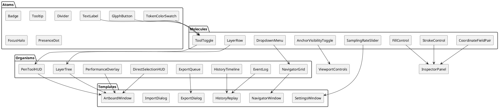

<!-- anchor: section-2-4 -->
### 2.4 Interaction State Matrix
| Component | Hover | Focus | Active | Disabled | Notes |
| --- | --- | --- | --- | --- | --- |
| ToolToggle | Accent background 12%, icon tint lighten | Focus halo + white outline | Accent solid + drop shadow | 48% opacity, tooltip mentions reason | Maintains 200ms transition |
| NavigatorCard | Lift 4px, glow tinted by artboard color | Blue halo, keyboard accessible | Thumbnail border accent, context menu active | Blur thumbnail + strikethrough name when artboard disabled | Idle renders at 0.9 scale until hover to imply affordance |
| AnchorHandle | Expand 30%, show glow | Focus ring + axis indicator | Fills `Accent/Primary`, handles lock orientation indicator | Hidden when anchor visibility hidden | Maintains constant pixel size regardless of zoom |
| TimelineMarker | Increase luminance, show timestamp tooltip | White outline, accessible arrow key nav | Expands to show metadata | Desaturated, not selectable | Checkpoint markers include snapshot icon |
| Toast | Pause auto-dismiss timer | Outline accent, accessible via Tab | Dismiss or action highlight | n/a | Stacks upward with 8px gap |

<!-- anchor: section-3 -->
## 3. Application Structure & User Flows
WireTuner uses a multi-window paradigm: Navigator acts as root, each artboard within MDI windows. Routes map to Flutter `RouterDelegate` states rather than web URLs but are documented to formalize navigation logic across windows.

<!-- anchor: section-3-1 -->
### 3.1 Route Definitions
| Route ID | Window | Description | Entry Methods | Access Level |
| --- | --- | --- | --- | --- |
| `app://navigator` | Navigator Window | Root housing document tabs, artboard grid, search, filters. | App launch, File → Open, File → New | Authenticated user |
| `app://navigator/new-artboard` | Navigator Modal | New artboard dialog with presets. | Navigator `+` button, Shift+N | Authenticated |
| `app://navigator/thumbnail-context` | Navigator Context Menu | Rename, Duplicate, Delete, Export, Refresh. | Right-click artboard thumbnail | Authenticated |
| `app://artboard/:docId/:artboardId` | Artboard Window | Canvas editing environment with toolbars and overlays. | Double-click Navigator thumbnail, Window menu | Authenticated |
| `app://inspector/:docId/:artboardId` | Inspector Panel | Right dock showing object properties, layers, history. | Toggled from toolbar, `Tab` key | Authenticated |
| `app://history/:docId` | History Replay Window | Timeline scrubber, playback controls, metadata inspector. | Window → History, Cmd+Shift+H | Authenticated |
| `app://import` | Modal | File picker + compatibility report (SVG, AI, JSON). | File → Import, drag-drop file | Authenticated |
| `app://export` | Modal | Export options (SVG, PDF, JSON) per artboard/all. | File → Export, context menu | Authenticated |
| `app://settings` | Window | App + document-level settings. | Cmd+, or Edit → Preferences | Authenticated |
| `app://collaboration/presence` | Overlay | Live collaborator info, session controls. | View → Collaboration Panel | Authenticated |
| `app://performance` | Dock Panel | FPS, sampling, snapshot metrics. | View → Performance Overlay, `Ctrl+Alt+P` | Authenticated |
| `app://command-palette` | Overlay | Search actions, quick nav. | Cmd+K | Authenticated |
| `app://error-dialog` | Modal | Blocking error UI for saves/imports. | Triggered by error conditions | Authenticated |
| `app://autosave-toast` | Toast | Inline status for auto-save. | Auto triggered | Authenticated |
| `app://help/onboarding` | Overlay | Coach marks, tutorials. | Help → Walkthrough, first run | Authenticated |
| `app://collaboration/conflict` | Banner | OT conflict resolution UI. | Triggered when OT fails | Authenticated |
| `app://snapshot/progress` | Overlay | Snapshot creation progress. | When background snapshot runs > 1s | Authenticated |
| `app://telemetry/consent` | Modal | Telemetry opt-in/out controls. | First launch, settings | Authenticated |
| `app://shortcut-reference` | Overlay | Table of keyboard shortcuts. | Help → Shortcuts, `?` key | Authenticated |
| `app://license` | Modal | OSS licenses. | Help → Licenses | Authenticated |
| `app://update-available` | Banner | Informs of updates (future). | On update detection | Authenticated |

Additional route behaviors:

1. Navigator remains alive even if all artboard windows closed, maintaining document context.
2. Artboard windows remember MDI placement and per-artboard zoom/pan states via `ViewportState`.
3. Modals adopt macOS sheets or Windows dialogs depending on platform.
4. Command palette overlays the focused window; context-specific commands filtered by route.
5. Collaboration overlay anchors to right dock but can float as palette.

<!-- anchor: section-3-2 -->
### 3.2 Critical User Journeys (PlantUML)
#### Journey A: Pen Tool Path Creation & Event Recording
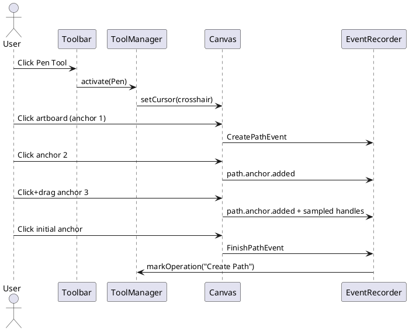

#### Journey B: Direct Selection & Sampling
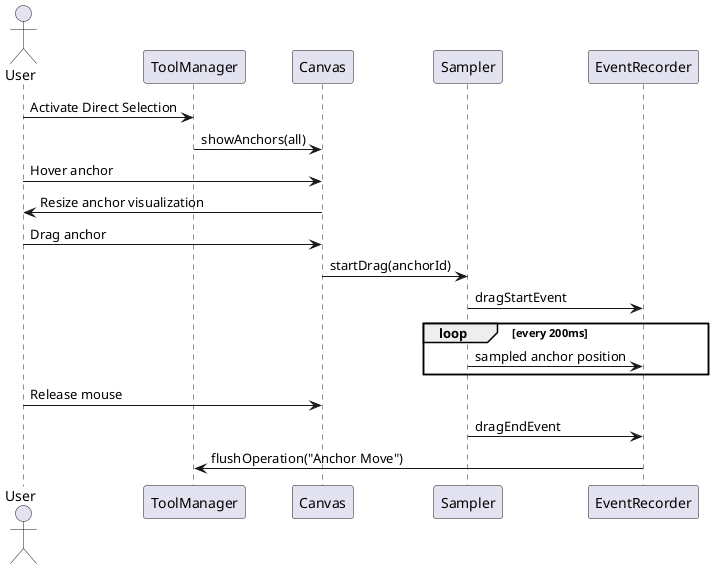

#### Journey C: Save Document with Snapshot
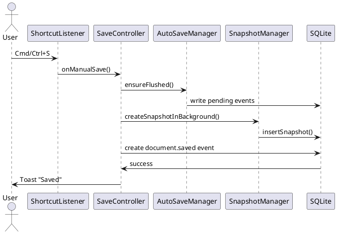

#### Journey D: Load Document with Artboard Navigator
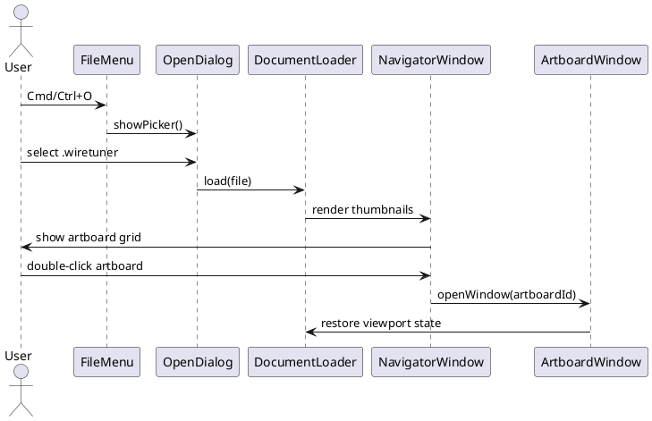

#### Journey E: Import SVG with Compatibility Report
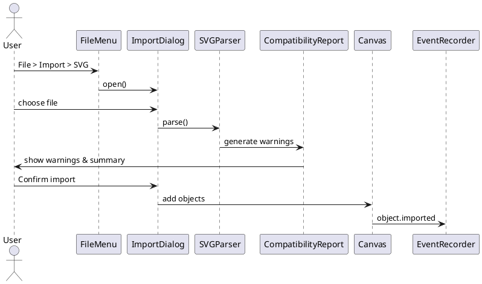

#### Journey F: Export PDF via SVG Pipeline
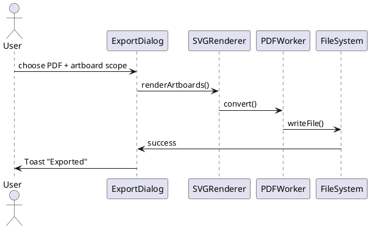

#### Journey G: Toggle Anchor Visibility Modes
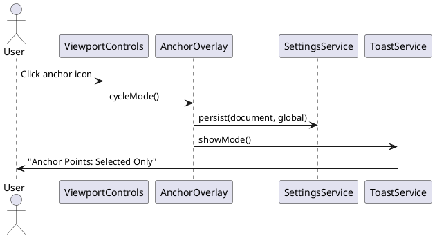

#### Journey H: Manage Artboards in Navigator
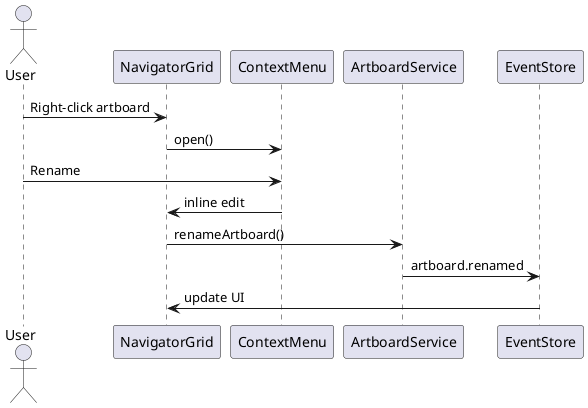

#### Journey I: Collaboration Session
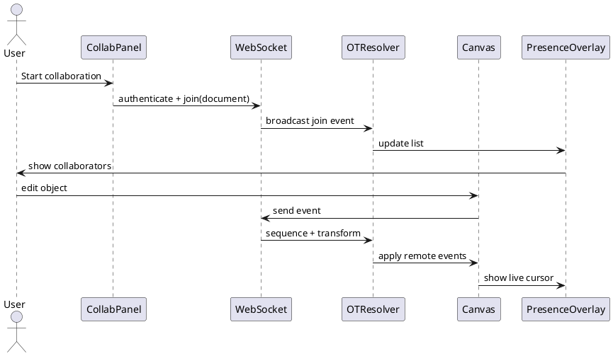

#### Journey J: History Replay Scrubbing
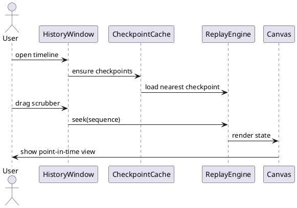

<!-- anchor: section-3-3 -->
### 3.3 Flow Annotations & Edge Cases
1. **Pen Tool Journey:** Display inline error if anchor limit reached (10,000). Provide tooltip near cursor and log to telemetry.
2. **Direct Selection Sampling:** Sampler flushes buffer when user holds Shift for grid snapping; ensures recorded delta uses screen-space rounding.
3. **Save Flow:** Disk full errors escalate to error dialog with retry, Save As, and link to docs.
4. **Load Flow:** If migration required, show modal with progress bar and auto-created backup path.
5. **Import Flow:** Offer preview toggles per layer; unsupported features listed with ability to copy log.
6. **Export Flow:** On failure, show option to open export log folder and copy error message.
7. **Anchor Toggle:** Keyboard shortcut surfaces toast plus ARIA live region update for screen readers.
8. **Navigator Flow:** Delete uses confirmation dialog with object/layer counts; last artboard deletion blocked.
9. **Collaboration:** When offline, panel indicates read-only, caches events to resend when online.
10. **History Replay:** When scrubbing fast, decimate intermediate frames but keep accuracy by jumping between checkpoints.

<!-- anchor: section-4 -->
## 4. Cross-Cutting Concerns

<!-- anchor: section-4-1 -->
### 4.1 State Management
- Provider + ChangeNotifier for UI-level reactive state; domain data remains immutable Freezed models.
- Split `GlobalAppState` (active documents, theme, feature flags) and `DocumentState` (artboards, selections, tools).
- Tools dispatch `ToolCommand`s to InteractionEngine, which records events then updates state via reducers.
- Viewport states stored per artboard; `ViewportController` publishes updates to overlays and inspector.
- Undo/redo stack interacts with EventStore; UI listens to `UndoState` to enable/disable controls and show operation names in status bar.
- Collaboration state uses `CollaborationProvider` hooking into WebSocket streams; merges remote events through OT before hitting reducers.
- Settings state persists to SQLite (document metadata) and JSON (global). UI subscribes to `SettingsStream` to update toggles live.

<!-- anchor: section-4-2 -->
### 4.2 Responsive Design (Desktop-First with Adaptive Panels)
- Breakpoints (window width): `Compact < 1024px`, `Regular 1024-1600px`, `Expanded > 1600px`.
- Compact: inspector collapses to accordion; Navigator uses list view; timeline overlays via toggle.
- Regular: standard dual-column layout; toolbars show text labels for critical commands.
- Expanded: allows multi-pane view (Navigator + Inspector + Timeline simultaneously), additional metadata columns.
- Height breakpoints: `Short < 768px` triggers toolbar icon-only representation and scrollable panels.
- Floating palettes reposition automatically to avoid screen edges when resizing windows.
- Multi-monitor support: MDI windows remember display and position; toasts appear on active window monitor.
- Snapshots of layout saved per workspace; user can switch presets (Drawing, Replay, Collaboration) which reorganize docked panels.

<!-- anchor: section-4-3 -->
### 4.3 Accessibility (WCAG 2.1 AA)
- Semantic labels: All tool toggles include descriptive labels and shortcuts for screen readers.
- Keyboard navigation: Roving tabindex for toolbars; arrow keys change selection, Enter toggles; Shift+F6 cycles major regions.
- Screen reader announcements for key events (save success, export failure, anchor mode change).
- High contrast: automatically switch to high-contrast token set if OS preference detected.
- Focus order documented for each template to prevent traps. Modals trap focus but include skip-to-content links.
- Captions & transcripts for onboarding videos; tooltips accessible via `?` key.
- Motion reduction: respect OS reduce motion; disable parallax, use fade transitions.
- Color-only cues reinforced with text or icon changes (e.g., anchor shapes, selection overlay thickness).

<!-- anchor: section-4-4 -->
### 4.4 Performance & Optimization
- Frame budget: ≤16ms for canvas interactions; overlays render in separate layer to avoid layout thrash.
- Virtualization: Navigator grid, layer tree, event log implement windowing via `ViewportAwareList`.
- Memoization: Toolbars and inspector groups memoize derived data to avoid rebuild on unrelated events.
- Code splitting: Non-critical panels (History Replay, Asset Library) lazy-loaded; show skeleton placeholders.
- Image assets: Icon font + vector ensures minimal PNG usage; thumbnails generated async and cached per artboard.
- Snapshot instrumentation: record serialization time, compression ratio; show warnings if >500ms.
- Telemetry: `performance.render.fps`, `performance.event.replay.rate`, `performance.snapshot.ms` metrics feed overlay and backend.
- Resource fallback: GPU failure triggers CPU renderer with notification and telemetry event.

<!-- anchor: section-4-5 -->
### 4.5 Backend Integration
- API communication via GraphQL for metadata, WebSocket for collaboration events, REST for telemetry.
- Authentication: short-lived JWT stored in OS keychain; auto-refresh hidden from UI.
- Error handling: API errors surface as toasts + inline panel banners with remediation steps.
- Offline mode: - queue operations locally, show yellow banner; collaboration panel greyed out.
- File operations strictly local; backend used only for optional sync and collaboration per design.
- Import/export workers: heavy conversions delegated to background isolate or remote worker via queue; UI polls or listens for job completion events.

<!-- anchor: section-4-6 -->
### 4.6 Internationalization & Localization
- Strings stored in ARB files; support bidirectional text in comments and inspector fields.
- Numeric formatting respects locale but preserves decimal precision for coordinates; use `.` as decimal internally, display locale-specific decimal if user chooses.
- Date/time formats follow locale for history events.
- Provide pseudo-localization test mode accessible from Settings to reveal truncation.
- Ensure icons remain culturally neutral; avoid text inside icons.

<!-- anchor: section-4-7 -->
### 4.7 Telemetry & Observability Hooks
- Each component includes optional instrumentation ID for telemetry correlation (e.g., `navigator.grid.cell.open`).
- Event log viewer can copy correlation IDs to expedite support.
- Performance overlay toggles send telemetry to align field data with user-perceived latency.
- Privacy: telemetry disabled when user opts out; UI indicates telemetry status in settings.
- Crash recovery: recover unsent telemetry logs and offer user option to send or discard on restart.

<!-- anchor: section-5 -->
## 5. Tooling & Dependencies

<!-- anchor: section-5-1 -->
### 5.1 Core Dependencies
- **Flutter 3.x** — Desktop rendering engine.
- **Provider + Riverpod-lite (internal)** — State management consistent with foundation doc.
- **Freezed + json_serializable** — Immutable models.
- **sqflite_common_ffi** — SQLite access for desktop.
- **ffi + resvg** — SVG-to-PDF conversion.
- **xml** — SVG parsing for import/export.
- **web_socket_channel** — Collaboration streaming.
- **graphql_flutter** — Metadata queries/mutations.
- **intl** — Localization.
- **go_router / custom RouterDelegate** — Window routing.
- **lottie** — Subtle onboarding animations (respect reduce motion).
- **package_info_plus** — Version display for telemetry.

<!-- anchor: section-5-2 -->
### 5.2 Development Tooling
- **Melos** orchestrates multi-package workspace (core UI, tooling, infrastructure adapters).
- **Very Good Analysis** lints; customized to enforce token usage.
- **Flutter Golden Toolkit** for visual regression of components and overlays.
- **Integration tests** via `integration_test` harness simulate complex flows (multi-artboard, import/export, collaboration handshake).
- **CI**: GitHub Actions + macOS/Windows runners building DMG/MSI nightly; includes golden diff upload and perf benchmark summary.
- **Telemetry sandbox** for manual validation of instrumentation events.
- **Design token exporter** ensures Figma tokens stay in sync with Flutter theme.

<!-- anchor: section-5-3 -->
### 5.3 QA & UX Validation Processes
- Weekly heuristic reviews ensure tool discoverability, anchor visibility clarity, and toast messaging.
- Accessibility audits each milestone using VoiceOver/Narrator; automated tests check color contrast.
- Performance regression tests run nightly; results visible in Performance overlay as reference.
- Beta telemetry dashboards highlight most-used tools, error spikes, snapshot durations to guide UX refinements.
- Storybook-like playground (Flutter `Widgetbook`) hosts interactive examples for designers and developers to validate states.
- Research panel tasks: multi-artboard navigation, history replay comprehension, collaboration conflict resolution.

<!-- anchor: section-5-4 -->
### 5.4 Documentation & Ops Alignment
- UI architecture documented in `/docs/uiux` with per-component READMEs referencing tokens and behavior guidelines.
- Ops receives annotated screenshots/lottie clips for installer QuickLook/Explorer thumbnail alignment.
- Release notes include UX-impacting changes, new shortcuts, and updated accessibility coverage.
- Design debt backlog tracks token exceptions, component variants pending refactor, and research findings.

<!-- anchor: section-6 -->
## 6. Appendices & Playbooks
Additional guidance ensures every specialized workflow (boolean operations, typography, collaboration, replay) remains consistent as the application scales.

<!-- anchor: section-6-1 -->
### 6.1 Tool-Specific Interaction Heuristics
1. **Selection Tool** — Always show bounding boxes for ≥1 object, display object count in status bar, animate transitions under 150ms.
2. **Direct Selection Tool** — Keep anchor overlays visible even when switching layers; provide inline badges for anchor types; highlight handles with color-coded segments to reflect lock state.
3. **Pen Tool** — Provide live preview of next segment; show handles before pointer release when user drags; Esc cancels entire path with toast confirmation; double-click toggles between smooth/corner anchors.
4. **Shape Tools** — Display ghost shape with handles; hold Shift to constrain, Alt to draw from center, Space to reposition mid-creation; preview dimension labels update in real time.
5. **Text Tool** — Click once for point text, drag for area text; show placeholder baseline grid; open `TextFormattingRibbon` automatically.
6. **Boolean Toolset** — When multiple objects selected, show inline badges describing stacking order; highlight resulting shape preview before commit; store last operation per session for quick repeat.
7. **Viewport/Pan Tool** — Holding spacebar temporarily activates pan while showing hand cursor; release returns to prior tool; display zoom level overlay when pinch gesture detected.
8. **Eyedropper** — Expands to 32px sampling circle; provides tooltip with sampled fill/stroke/opacity; pressing Enter applies to selection, Esc cancels.
9. **Artboard Tool** — Display rulers and guidelines; creation snaps to preset sizes when near known ratios; inspector updates to artboard properties automatically.
10. **Gradient Editor** — Offers inline easing controls; arrow keys move selected stop by 1px screen equivalent; focusable handles ensure keyboard editing.
11. **Timeline Scrubber** — Dragging shows operation name and timestamp; shift-scrub snaps to checkpoints; double-click plays from selected operation.
12. **Comment Tool** — Pins numbered markers; pressing Enter opens inline composer; presence icons show active commenters.
13. **Measurement Tool** — Allows temporary measurement lines; shift locks axis; measurement persists until Escape.
14. **Slice Tool (export)** — Draws export slices; inspector reveals format presets; right-click slice for quick export.
15. **Snapshot Manager UI** — Shows background progress overlay; user can prioritize snapshot creation via command; warnings appear if memory insufficient.

<!-- anchor: section-6-2 -->
### 6.2 Component State Narratives
- **NavigatorCard States**
  - *Default:* 80% scale, subtle drop shadow.
  - *Hover:* 100% scale, `shadow/sm`, show quick actions overlay.
  - *Selected:* Accent border 2px, context menu icon visible.
  - *Dirty:* Adds dot badge at top-right, tooltip indicates unsaved changes.
  - *Thumbnail Refreshing:* Applies shimmer effect, progress arc at corner.
- **LayerRow States**
  - *Hover:* Show inline rename icon.
  - *Lock Active:* Gray overlay, lock icon solid, editing disabled.
  - *Visibility Off:* Icon crossed; row text remains legible but 60% opacity.
  - *Active Selection:* Row background accent tinted, keyboard focus ring inline.
- **TimelineMarker**
  - *Checkpoint:* Filled circle with snapshot icon.
  - *Current:* Diamond shape, drop shadow, label persists.
  - *Played Past:* Reduced opacity 40%, still interactive.
- **Toast**
  - *Info:* Blue accent icon, auto-dismiss 4s.
  - *Warning:* Amber icon, requires manual dismissal.
  - *Error:* Pink icon, includes “Report Bug” CTA.
- **Context Menu**
  - *Nested Level:* Indent 16px, arrow indicator; uses delay to avoid accidental close.
  - *Keyboard Navigation:* Up/Down to move, Right to open sub-menu, Left to exit.
- **ArtboardWindow Template**
  - *Compact Height:* Collapses bottom timeline into overlay; inspector becomes tabbed.
  - *Regular:* Standard layout.
  - *Expanded:* Allows dual inspector columns (Layers + Properties simultaneously) and persistent history timeline.

<!-- anchor: section-6-3 -->
### 6.3 Accessibility QA Checklist
1. Run VoiceOver/Narrator through tool activation, anchor toggles, timeline scrubbing, Navigator interactions.
2. Verify keyboard-only creation of artboards, shapes, exports, and rename flows.
3. Confirm focus visible in all states (Navigator cards, timeline, inspector controls, modals).
4. Test color contrast with automated tooling; ensure dynamic text (e.g., toasts, status) meets 4.5:1.
5. Validate high-contrast theme toggles automatically when OS preference changes without restart.
6. Ensure ARIA live regions announce saves, exports, anchor mode changes, collaboration join/leave events.
7. Confirm reduce motion preference disables animated backgrounds, timeline inertia, and toast slide transitions.
8. Validate pointer target sizes (≥40px) on Windows scaling 125% and macOS retina screens.
9. Confirm localization expansions do not truncate buttons; tooltip fallback handles long text via scroll or wrap.
10. Document results per release, capturing screenshots and logs for audit.

<!-- anchor: section-6-4 -->
### 6.4 Responsive Layout Recipes
| Layout | Compact | Regular | Expanded |
| --- | --- | --- | --- |
| Artboard Window | Stack inspector + layers as tabs, collapsible timeline overlay | Side-by-side inspector/layers, bottom timeline | Add Navigator mini-grid dock, show collaboration panel inline |
| Navigator Window | List view, 2-column grid | 4-column grid, filters row | 6-column grid, filter + sort persistent, stats sidebar |
| Settings Window | Single column with accordion sections | Two-column with nav tree + content | Add contextual help panel, preview column |
| History Replay | Timeline overlays canvas | Timeline bottom, metadata panel collapsible | Timeline bottom, metadata right, event log list left |
| Collaboration Panel | Floating palette | Docked panel with avatar grid | Full-height panel with chat (future), analytics |
| Import/Export Dialog | Vertical wizard steps | Horizontal steps with summary card | Multi-column summary showing per-artboard overrides |

Layout shifting rules:

- Use `AnimatedSwitcher` for panel transitions with fade+scale to reduce layout jank.
- Save layout presets per workspace; allow quick switching via command palette.
- Multi-window interactions coordinate breakpoints per window, not globally; ensures artboard window can be compact while Navigator remains expanded on other display.

<!-- anchor: section-6-5 -->
### 6.5 Event Overlay Color Mapping Reference
```json
{
  "overlays": {
    "selection": {
      "stroke": "rgba(79,178,255,0.75)",
      "fill": "rgba(79,178,255,0.08)",
      "handles": {
        "smooth": "#FF5C5C",
        "corner": "#080A0E",
        "tangent": "#FFA345"
      }
    },
    "history-playhead": {
      "marker": "#6F7CFF",
      "trail": "rgba(111,124,255,0.4)",
      "ghost": "rgba(111,124,255,0.15)"
    },
    "sampling": {
      "heat-low": "#132A3A",
      "heat-mid": "#4FB2FF",
      "heat-high": "#F05C91",
      "tooltip": "#1C222C"
    },
    "collaboration": {
      "cursor": {
        "stroke": "#FFFFFF",
        "fill": "#000000",
        "shadow": "rgba(0,0,0,0.35)"
      },
      "selection": {
        "palette": ["#FF9BAE","#FFD66F","#5DFFB1","#7FE2FF","#B18CFF"]
      }
    },
    "grid": {
      "minor": "rgba(58,63,73,0.6)",
      "major": "rgba(79,85,98,0.9)",
      "axis": "#87D2FF"
    },
    "viewport": {
      "pan-path": "rgba(92,255,206,0.4)",
      "zoom-indicator": "#4FB2FF",
      "hint": "#53D3FF"
    },
    "undo-redo": {
      "undo": "#FFC75F",
      "redo": "#9CFFFA",
      "cleared": "rgba(255,92,115,0.3)"
    },
    "performance": {
      "fps-good": "#5CFFCE",
      "fps-warn": "#FFB347",
      "fps-bad": "#FF5C73"
    }
  }
}
```

<!-- anchor: section-6-6 -->
### 6.6 Collaboration Presence Microcopy
- "{name} is editing {artboard}" — displayed in presence panel, localized with named tokens.
- "Latency {ms} (stable)" — appended to avatar tooltips; status adjectives change to “spiking” (>120ms) or “recovering” when conditions improve.
- "Conflict resolved automatically" — banner text with link to timeline diff.
- "Offline edits queued" — status bar message when WebSocket disconnected; includes CTA to retry connection.
- In-app help includes glossary for OT, sampling, snapshots to reduce confusion.

<!-- anchor: section-6-7 -->
### 6.7 Research & Validation Backlog
1. **Anchor Visibility Discoverability Study** — Evaluate whether icon placement near viewport controls improves recall vs status bar placement.
2. **Navigator Density Benchmark** — Compare comprehension time between 4-column vs 6-column grids on 27" displays.
3. **History Replay Speed Control** — Test slider vs discrete buttons for 0.5×-10× playback.
4. **Collaboration Conflict Modal** — Validate language clarity for remote edits overriding local state.
5. **Autosave Indicator** — Determine if subtle animations suffice or needs textual feedback for enterprise teams.
6. **Sampling Slider Explanation** — Ensure estimated file size messaging aids comprehension; refine copy if confusing.
7. **Command Palette Onboarding** — AB test highlight vs tooltip vs walkthrough for new users.
8. **Artboard Preset Dialog** — Research top-used presets to reorder list; ensure search meets needs for custom dimensions.
9. **Boolean Toolbar Layout** — Evaluate vertical vs horizontal arrangement for left-handed workflows.
10. **Color Blindness Modes** — Validate anchor shape differentiation alone suffices for users with color limitations.

<!-- anchor: section-6-8 -->
### 6.8 Terminology Glossary for UI Copy
| Term | Definition | Usage |
| --- | --- | --- |
| Snapshot | Serialized document state stored at checkpoint | History timeline, save dialog |
| Sampling | Optional interim pointer capture for replay | Settings, performance overlay |
| Artboard Navigator | Root window for multi-artboard management | Navigator window, help center |
| Viewport | Canvas transformation state (zoom/pan) | Status bar, inspector |
| Operation | Undo/redo boundary grouping events | Status bar, history timeline |
| Presence | Real-time collaborator indicator | Collaboration panel |
| Replay | Visualization of event history | History window |
| Thumbnail Refresh | Regeneration of artboard preview image | Navigator grid |
| Autosave | Automatic persistence after idle threshold | Status bar, toast |
| Conflict | Concurrent edit requiring OT resolution | Collaboration banner |

<!-- anchor: section-6-9 -->
### 6.9 Localization-ready Strings (Samples)
```json
{
  "toast_saved": "Saved successfully",
  "toast_autosave": "Auto-saved",
  "toast_anchor_all": "Anchor Points: All Visible",
  "toast_anchor_selected": "Anchor Points: Selected Paths Only",
  "toast_anchor_hidden": "Anchor Points: Hidden",
  "warning_disk_full": "Cannot save: Disk full. Free up space and retry.",
  "warning_conflict": "Collaboration conflict detected. Review changes.",
  "status_zoom_hint": "Press Cmd/Ctrl + = to zoom in for finer control",
  "status_sampling": "Sampling every {interval} ms",
  "dialog_delete_artboard_title": "Delete artboard '{name}'?",
  "dialog_delete_artboard_body": "This will remove {objects} objects and {layers} layers.",
  "dialog_conflict_primary": "Review remote changes",
  "dialog_conflict_secondary": "Keep my version",
  "export_success": "Exported {format} to {path}",
  "import_warning": "Import complete with warnings. {count} features unsupported.",
  "navigator_search_placeholder": "Search artboards or layers",
  "command_palette_placeholder": "Type a command or search",
  "collab_offline": "Collaboration offline. Working locally.",
  "presence_editing": "Editing {artboard}",
  "history_checkpoint": "Snapshot #{sequence}",
  "settings_sampling_label": "Mouse sampling interval"
}
```

<!-- anchor: section-6-10 -->
### 6.10 Operational Dashboards & UX KPIs
- **Navigator Efficiency** — average time to open artboard from Navigator; target <2s.
- **History Replay Adoption** — % of sessions using replay; track drop-off per control surfaces.
- **Export Success Rate** — target 99.5%; categorize by format (SVG/PDF/JSON).
- **Autosave Perception** — survey results correlated with telemetry on manual saves per hour.
- **Sampling Adjustment Frequency** — indicates whether default 200ms suits majority; use to inform onboarding copy.
- **Collaboration Latency** — track median vs 95th percentile; present inside collaboration panel for transparency.
- **Performance Overlay Usage** — indicates whether users rely on overlay or need proactive alerts.
- **Undo Stack Depth** — monitor operations trimmed by MAX_UNDO_DEPTH to gauge need for adjustments.
- **Crash Recovery Success** — measure ability to reopen documents without data loss; tie to UI copy explaining restoration.

<!-- anchor: section-6-11 -->
### 6.11 Future Enhancements Tracking
1. Plugin dock placeholder visuals ensure future plugin integration does not disturb existing layout.
2. Touch support feasibility captured; UI components maintain minimum target sizes for eventual tablet builds.
3. Extended collaboration chat panel design kept in backlog with placeholder icons.
4. AR/VR preview toggles reserved in status bar for long-term research; icons grayed out but explained in help.
5. Color theme editor planned; tokens already support create/update flows.

