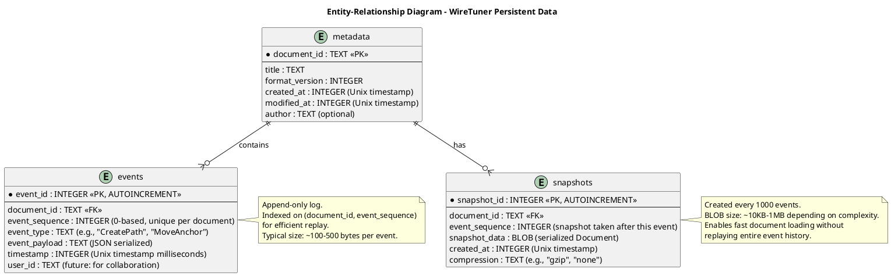

# Task Briefing Package

This package contains all necessary information and strategic guidance for the Coder Agent.

---

## 1. Current Task Details

This is the full specification of the task you must complete.

```json
{
  "task_id": "I1.T1",
  "iteration_id": "I1",
  "iteration_goal": "Establish project infrastructure, initialize Flutter project, integrate SQLite, and document event sourcing architecture",
  "description": "Initialize Flutter desktop project with proper directory structure, configure analysis_options.yaml for strict linting, set up pubspec.yaml with initial dependencies (sqflite_common_ffi, provider, logger, freezed, vector_math), and create basic main.dart entry point. Configure macOS and Windows build targets. Create README.md with project overview.",
  "agent_type_hint": "SetupAgent",
  "inputs": "Project plan Section 3 (Directory Structure), Technology stack requirements (Flutter 3.16+, Dart 3.2+), Linting rules from architecture blueprint (analysis_options.yaml recommendations)",
  "target_files": [
    "pubspec.yaml",
    "lib/main.dart",
    "lib/app.dart",
    "analysis_options.yaml",
    "README.md",
    ".gitignore",
    "macos/",
    "windows/"
  ],
  "input_files": [],
  "deliverables": "Working Flutter project that compiles and runs on macOS/Windows, Configured dependencies in pubspec.yaml, Strict linting rules enforced, Basic app widget with placeholder UI, README documenting project setup",
  "acceptance_criteria": "`flutter pub get` succeeds without errors, `flutter analyze` passes with zero issues, `flutter run -d macos` launches application window, `flutter run -d windows` launches application window (if on Windows), All required dependencies listed in pubspec.yaml, Directory structure matches plan Section 3",
  "dependencies": [],
  "parallelizable": false,
  "done": false
}
```

---

## 2. Architectural & Planning Context

The following are the relevant sections from the architecture and plan documents, which I found by analyzing the task description.

### Context: Technology Stack Overview (from 02_Architecture_Overview.md)

```markdown
### 3.2. Technology Stack Summary

#### Core Platform

| Layer | Technology | Version | Justification |
|-------|-----------|---------|---------------|
| **Framework** | Flutter | 3.16+ | Cross-platform desktop, mature CustomPainter API, strong ecosystem |
| **Language** | Dart | 3.2+ | Required by Flutter, null-safe, good performance |
| **Desktop Targets** | macOS, Windows | - | Primary platforms for professional vector editing |

#### Data & Persistence

| Component | Technology | Package/Library | Justification |
|-----------|-----------|-----------------|---------------|
| **Event Store** | SQLite | `sqflite_common_ffi` | Embedded database, ACID compliance, zero-config, portable files |
| **Schema** | SQL DDL | - | Direct SQL for event log, snapshot, document tables |
| **File Format** | .wiretuner (SQLite) | - | Self-contained file format, readable with standard SQLite tools |

#### State Management

| Component | Technology | Package | Justification |
|-----------|-----------|---------|---------------|
| **App State** | Provider | `provider` 6.0+ | Lightweight, sufficient for single-user desktop app |
| **Event Sourcing** | Custom | - | Purpose-built event recorder, replayer, snapshot manager |
| **Immutability** | Freezed (optional) | `freezed` | Code generation for immutable models with copy constructors |

#### Development & Testing

| Purpose | Technology | Package | Justification |
|---------|-----------|---------|---------------|
| **Unit Tests** | Dart test | `test` | Core logic verification |
| **Widget Tests** | Flutter test | `flutter_test` | UI component testing |
| **Integration Tests** | Flutter integration | `integration_test` | End-to-end workflow testing |
| **Code Coverage** | lcov | - | Track test coverage (target 80%+) |
| **Linting** | Dart analyzer | `analysis_options.yaml` | Code quality enforcement |

#### Technology Selection Rationale

**Why Flutter for Desktop Vector Editor?**
- **CustomPainter Performance**: Proven 60 FPS rendering capability for complex graphics
- **Cross-Platform**: Single codebase for macOS/Windows reduces maintenance burden
- **Native Compilation**: Dart compiles to native machine code, no runtime overhead
- **Mature Ecosystem**: Strong package ecosystem (PDF, XML, file I/O)
- **Reference Success**: Apps like Rive demonstrate Flutter's suitability for vector editing

**Why SQLite for Event Storage?**
- **ACID Guarantees**: Ensures event log integrity even during crashes
- **Embeddable**: No separate database server, zero configuration
- **Portable Format**: .wiretuner files are standard SQLite databases, tooling available
- **Performance**: Adequate for 50ms sampling rate (20 events/second max)
- **Proven**: SQLite is the most deployed database engine globally

**Why Provider for State Management?**
- **Simplicity**: Adequate for single-user desktop app without complex state needs
- **Flutter-Native**: Official Flutter recommendation, good documentation
- **Lightweight**: Minimal boilerplate compared to BLoC, Redux
- **Sufficient**: Event sourcing handles time-travel, Provider handles UI reactivity
```

### Context: Directory Structure Definition (from 01_Plan_Overview_and_Setup.md)

```markdown
## 3. Directory Structure

*   **Root Directory:** `wiretuner/`

*   **Structure Definition:**

```
wiretuner/
├── lib/
│   ├── main.dart                          # Application entry point
│   ├── app.dart                           # Root widget, routing, theme
│   │
│   ├── presentation/                      # UI Layer
│   │   ├── pages/
│   │   │   └── main_page.dart             # Main editor page
│   │   ├── widgets/
│   │   │   ├── canvas/
│   │   │   │   ├── canvas_widget.dart     # Main canvas container
│   │   │   │   ├── canvas_painter.dart    # CustomPainter implementation
│   │   │   │   └── overlay_painter.dart   # Tool overlays (handles, guides)
│   │   │   ├── toolbar/
│   │   │   │   ├── tool_toolbar.dart      # Tool selection UI
│   │   │   │   └── tool_button.dart       # Individual tool button
│   │   │   └── panels/
│   │   │       ├── properties_panel.dart  # Object properties editor
│   │   │       └── layers_panel.dart      # Layer management (future)
│   │   └── providers/
│   │       ├── document_provider.dart     # Document state (ChangeNotifier)
│   │       └── tool_manager_provider.dart # Active tool state
│   │
│   ├── application/                       # Application Layer (Use Cases)
│   │   ├── tools/
│   │   │   ├── tool_interface.dart        # ITool abstract interface
│   │   │   ├── tool_manager.dart          # Tool lifecycle management
│   │   │   ├── pen_tool.dart              # Pen tool implementation
│   │   │   ├── selection_tool.dart        # Selection tool
│   │   │   ├── direct_selection_tool.dart # Direct selection tool
│   │   │   ├── rectangle_tool.dart        # Rectangle shape tool
│   │   │   ├── ellipse_tool.dart          # Ellipse shape tool
│   │   │   ├── polygon_tool.dart          # Polygon shape tool
│   │   │   └── star_tool.dart             # Star shape tool
│   │   └── services/
│   │       ├── document_service.dart      # Document CRUD operations
│   │       └── cursor_service.dart        # Cursor management
│   │
│   ├── domain/                            # Domain Layer (Business Logic)
│   │   ├── models/
│   │   │   ├── document.dart              # Document root model
│   │   │   ├── layer.dart                 # Layer model
│   │   │   ├── vector_object.dart         # Abstract base class
│   │   │   ├── path.dart                  # Path model
│   │   │   ├── shape.dart                 # Shape model (rect, ellipse, etc.)
│   │   │   ├── segment.dart               # Path segment model
│   │   │   ├── anchor_point.dart          # Anchor point model
│   │   │   ├── style.dart                 # Fill/stroke style model
│   │   │   ├── transform.dart             # Transformation matrix model
│   │   │   ├── selection.dart             # Selection state model
│   │   │   └── viewport.dart              # Viewport state (pan, zoom)
│   │   ├── events/
│   │   │   ├── event_base.dart            # Base event class
│   │   │   ├── path_events.dart           # CreatePath, AddAnchor, etc.
│   │   │   ├── object_events.dart         # MoveObject, DeleteObject, etc.
│   │   │   └── style_events.dart          # ModifyStyle events
│   │   └── services/
│   │       ├── geometry_service.dart      # Bezier math, intersections
│   │       ├── hit_test_service.dart      # Point-in-path, distance calculations
│   │       └── path_operations.dart       # Boolean ops (future), offset, simplify
│   │
│   ├── infrastructure/                    # Infrastructure Layer
│   │   ├── event_sourcing/
│   │   │   ├── event_recorder.dart        # Records events with sampling
│   │   │   ├── event_replayer.dart        # Replays events to reconstruct state
│   │   │   ├── event_dispatcher.dart      # Routes events to handlers
│   │   │   ├── event_handler_registry.dart # Maps event types to handlers
│   │   │   ├── event_sampler.dart         # 50ms throttling logic
│   │   │   ├── snapshot_manager.dart      # Snapshot creation/loading
│   │   │   └── snapshot_serializer.dart   # Document <-> binary codec
│   │   ├── persistence/
│   │   │   ├── database_provider.dart     # SQLite connection management
│   │   │   ├── event_store.dart           # Event table CRUD
│   │   │   ├── snapshot_store.dart        # Snapshot table CRUD
│   │   │   └── metadata_store.dart        # Metadata table CRUD
│   │   ├── import_export/
│   │   │   ├── svg_exporter.dart          # SVG 1.1 XML generation
│   │   │   ├── pdf_exporter.dart          # PDF 1.7 generation
│   │   │   ├── ai_importer.dart           # Adobe Illustrator parser
│   │   │   └── svg_importer.dart          # SVG XML parser
│   │   └── logging/
│   │       └── logger_config.dart         # Logging setup (file + console)
│   │
│   └── utils/                             # Shared utilities
│       ├── constants.dart                 # App-wide constants
│       └── extensions.dart                # Dart extension methods
│
├── test/                                  # Unit and widget tests
├── integration_test/                      # End-to-end integration tests
├── docs/                                  # Documentation and design artifacts
│   ├── diagrams/                          # Architecture diagrams
│   ├── api/                               # API documentation
│   ├── adr/                               # Architectural Decision Records
│   └── testing/
│       └── testing_strategy.md            # Test coverage and approach
│
├── api/                                   # Event schema definitions
│   ├── event_schema.dart                  # Sealed event class hierarchy
│   └── event_types.md                     # Documentation of event types
│
├── assets/                                # Application assets
│   ├── icons/                             # Tool icons, app icons
│   └── fonts/                             # Custom fonts (if needed)
│
├── macos/                                 # macOS platform-specific code
├── windows/                               # Windows platform-specific code
│
├── analysis_options.yaml                  # Dart analyzer linting rules
├── pubspec.yaml                           # Flutter dependencies
├── README.md                              # Project README
└── LICENSE                                # License file
```

**Justification:**
*   **Layered Structure:** Clear separation of concerns (presentation, application, domain, infrastructure)
*   **Feature-Based Organization:** Tools grouped together, event sourcing components co-located
*   **Testability:** Parallel `test/` structure mirrors `lib/` for easy navigation
*   **Documentation:** Centralized `docs/` with dedicated subdirectories for diagrams, API contracts, and ADRs
```

### Context: Linting Quality Gates (from 03_Verification_and_Glossary.md)

```markdown
#### Linting
*   **Tool:** Dart analyzer with strict rules (`analysis_options.yaml`)
*   **Rules Enforced:**
    *   `avoid_dynamic_calls` - Prevent untyped method calls
    *   `prefer_const_constructors` - Use const where possible for performance
    *   `cancel_subscriptions` - Prevent memory leaks
    *   `close_sinks` - Ensure streams closed properly
    *   `unnecessary_null_checks` - Leverage null safety
*   **Gate:** CI/CD fails if `flutter analyze` returns any issues

#### Test Coverage Minimums
*   **Domain Layer:** 85%+ line coverage
*   **Infrastructure Layer:** 80%+ line coverage
*   **Presentation Layer:** 70%+ line coverage
*   **Application Layer:** 75%+ line coverage
*   **Overall Project:** 80%+ line coverage
*   **Gate:** CI/CD warns if coverage drops below target

#### Code Review (Single Developer Adaptation)
*   **Self-Review Checklist:**
    *   [ ] All unit tests pass locally
    *   [ ] Code follows project style (consistent naming, formatting)
    *   [ ] No commented-out code (use git history instead)
    *   [ ] Complex logic has explanatory comments
    *   [ ] Public APIs have dartdoc comments
    *   [ ] No hardcoded paths or magic numbers
    *   [ ] Null safety enforced (no `!` operators without justification)
*   **Automated Checks:**
    *   Dart formatter (`flutter format --set-exit-if-changed`)
    *   Import sorting (via `flutter format`)
    *   No TODOs in production code (grep check on CI)

#### Documentation Quality
*   **Required Documentation:**
    *   Public classes and methods have dartdoc comments
    *   README.md up-to-date with setup instructions
    *   Architectural diagrams kept in sync with code
    *   ADRs written for major decisions
*   **Gate:** CI/CD warns if dartdoc coverage drops below 80%
```

### Context: Project Overview and Requirements (from 01_Plan_Overview_and_Setup.md)

```markdown
## 1. Project Overview

*   **Goal:** Build a professional, event-sourced vector drawing application for macOS/Windows using Flutter, delivering a working editor with pen tool, shape creation (rectangle, ellipse, polygon, star), anchor/BCP manipulation, and save/load functionality within ~21 days.

*   **High-Level Requirements Summary:**
    *   Event-sourced architecture with 50ms sampling rate for all user interactions
    *   SQLite-based persistence with .wiretuner file format
    *   Flutter CustomPainter rendering engine targeting 60 FPS
    *   Core vector editing tools: Pen (straight/Bezier), Selection, Direct Selection
    *   Shape creation tools: Rectangle, Ellipse, Polygon, Star
    *   Direct manipulation: drag objects, anchor points, and Bezier control points
    *   Immutable domain models (Path, Shape, Document)
    *   Snapshot system (every 1000 events) for performance optimization
    *   File operations: save/load .wiretuner documents with version compatibility
    *   Import/Export: Adobe Illustrator import, SVG/PDF export
    *   Support documents with 10,000+ objects without degradation

*   **Key Assumptions:**
    *   Single developer with Flutter/Dart expertise, ~8 hours/day focused development
    *   Desktop-first focus (macOS 10.15+, Windows 10 1809+), mobile platforms deferred
    *   Single-user workflows (collaborative features architecturally supported but not implemented)
    *   SQLite provides adequate performance for event log persistence
    *   Flutter desktop is stable enough for production use (3.16+)
    *   50ms sampling rate provides sufficient fidelity without overwhelming storage
    *   Snapshots every 1000 events balance memory usage with replay speed
    *   Expected file sizes remain manageable (< 100MB typical, < 500MB maximum)
    *   Test coverage target: 80%+ for core logic (models, services)
```

### Context: Database Schema (from 03_System_Structure_and_Data.md)

```markdown
#### Event Sourcing Schema (SQLite Tables)

**Rationale for SQLite Schema Design:**
- **Append-only `events` table**: Ensures event immutability, supports efficient replay via indexed `event_sequence`
- **Periodic `snapshots` table**: Avoids replaying entire event history (10,000 events = ~1 minute replay time; snapshot every 1000 events reduces to ~50ms)
- **`metadata` table**: Stores document-level info (title, created date, version) separate from event stream
- **ACID guarantees**: SQLite transactions ensure no partial writes during crashes

#### Key Entities

**Persistent Entities (SQLite):**
- **Event**: Immutable record of user interaction (type, payload, timestamp, sequence number)
- **Snapshot**: Serialized document state at a specific event sequence
- **Metadata**: Document-level properties (title, version, created/modified timestamps)

**ERD (PlantUML):**


```

---

## 3. Codebase Analysis & Strategic Guidance

The following analysis is based on my direct review of the current codebase. Use these notes and tips to guide your implementation.

### Current Project State

**Project Status:** The project directory exists but contains NO Flutter code yet. This is a completely fresh start.

**Existing Structure:**
```
wiretuner/
├── .codemachine/              # Build system metadata and documentation
│   ├── artifacts/
│   │   ├── architecture/      # Comprehensive architecture documentation
│   │   └── plan/              # Detailed iteration plans
│   ├── inputs/
│   │   ├── specifications.md  # Ticket index (T001-T039)
│   │   └── tickets/           # Individual ticket files
│   └── prompts/               # This briefing package
├── thoughts/                  # Product vision and research notes
├── .gitignore
└── .git/                      # Git repository initialized
```

**What's Missing:** Everything! No Flutter project exists yet. No `pubspec.yaml`, no `lib/` directory, no platform directories (macos/, windows/).

### Implementation Strategy for I1.T1

This task is the **foundation** of the entire project. You are creating everything from scratch.

#### Step-by-Step Execution Plan

**1. Initialize Flutter Desktop Project**
   - Run: `flutter create --platforms=macos,windows --project-name=wiretuner .`
   - This will generate the base Flutter project structure
   - **WARNING:** This will create files in the current directory. Make sure you're in `/Users/tea/dev/github/wiretuner`

**2. Configure pubspec.yaml**
   - Replace the generated pubspec.yaml with dependencies from the architecture
   - **CRITICAL DEPENDENCIES TO ADD:**
     ```yaml
     dependencies:
       flutter:
         sdk: flutter
       provider: ^6.0.0              # State management
       sqflite_common_ffi: ^2.3.0    # SQLite for desktop
       vector_math: ^2.1.0           # Matrix transformations
       logger: ^2.0.0                # Logging

     dev_dependencies:
       flutter_test:
         sdk: flutter
       freezed: ^2.4.0               # Immutable models (code generation)
       build_runner: ^2.4.0          # Required for freezed
       flutter_lints: ^3.0.0         # Linting rules
     ```
   - Set minimum Dart SDK: `sdk: '>=3.2.0 <4.0.0'`
   - Set minimum Flutter version in environment: `flutter: '>=3.16.0'`

**3. Create analysis_options.yaml**
   - **YOU MUST** implement the strict linting rules specified in the architecture
   - Enable all recommended lints from `package:flutter_lints/flutter.yaml`
   - Add custom rules:
     ```yaml
     include: package:flutter_lints/flutter.yaml

     analyzer:
       exclude:
         - "**/*.g.dart"
         - "**/*.freezed.dart"
       errors:
         invalid_annotation_target: ignore

     linter:
       rules:
         - avoid_dynamic_calls
         - prefer_const_constructors
         - cancel_subscriptions
         - close_sinks
         - unnecessary_null_checks
         - prefer_final_fields
         - avoid_print
         - prefer_single_quotes
         - sort_constructors_first
     ```

**4. Create lib/main.dart and lib/app.dart**
   - **main.dart** should:
     - Initialize logging
     - Run the app widget
     - Be minimal (5-10 lines)
   - **app.dart** should:
     - Define the root MaterialApp widget
     - Set app title: "WireTuner"
     - Use Material Design 3 (`useMaterial3: true`)
     - Create a placeholder home page with centered text: "WireTuner - Vector Drawing Application"
     - This is just a skeleton; real UI comes in later iterations

**5. Update .gitignore**
   - The Flutter-generated .gitignore should be fine
   - **VERIFY** it includes:
     - `*.g.dart` (generated files from freezed/build_runner)
     - `*.freezed.dart`
     - `.flutter-plugins`
     - `.flutter-plugins-dependencies`
     - `build/`

**6. Create README.md**
   - Document:
     - Project name and purpose
     - Prerequisites (Flutter 3.16+, Dart 3.2+)
     - Setup instructions (`flutter pub get`, `flutter run -d macos`)
     - Architecture overview (1-2 paragraphs)
     - Reference to docs/ for detailed documentation
   - Keep it concise but informative

**7. Verify Platform Configurations**
   - macOS: Ensure `macos/Runner/Info.plist` exists (Flutter creates this)
   - Windows: Ensure `windows/runner/` exists (Flutter creates this)
   - **NO CUSTOM MODIFICATIONS NEEDED** for platform directories yet

### Critical Success Factors

**Acceptance Criteria Validation:**
1. After implementation, run these commands in order:
   ```bash
   flutter pub get           # Must complete without errors
   flutter analyze          # Must show 0 issues
   flutter run -d macos     # Must launch window with "WireTuner - Vector Drawing Application" text
   ```

2. **Directory Structure Verification:**
   - After `flutter create`, verify all directories from plan Section 3 are created
   - If not, create them manually: `mkdir -p lib/{presentation,application,domain,infrastructure,utils}`
   - Create subdirectories as specified in the plan

### Important Notes and Warnings

**Tip #1: Flutter Create in Non-Empty Directory**
- Since the directory already has .git and .codemachine/, Flutter might warn you
- This is OK! The project root is correct
- If Flutter refuses, you may need to pass additional flags or work around it

**Tip #2: sqflite_common_ffi on macOS**
- This package requires the SQLite FFI library
- You may need to run: `flutter pub run sqflite_common_ffi:setup` after `flutter pub get`
- This is a known setup step for desktop SQLite support

**Tip #3: Freezed Setup**
- Freezed requires build_runner to generate code
- After adding dependencies, run: `flutter pub run build_runner build`
- This won't generate anything yet (no models), but verifies the setup works

**Warning #1: Platform Support**
- The task requires both macOS AND Windows targets
- However, Windows platform files won't be tested unless you're on a Windows machine
- Focus on macOS verification if you're on macOS (which you are, based on environment)

**Warning #2: Linting Strictness**
- The linting rules are VERY strict
- Every file must pass `flutter analyze` with zero issues
- If you encounter linting issues, fix them immediately; don't suppress them

**Warning #3: Directory Structure**
- The plan specifies a very detailed directory structure
- **YOU MUST** create all directories specified, even if they're empty initially
- Future tasks depend on this structure existing

### Project Conventions

Based on the architecture documentation, follow these conventions:

**Naming:**
- Use snake_case for file names (e.g., `event_recorder.dart`, not `EventRecorder.dart`)
- Use PascalCase for class names (e.g., `EventRecorder`)
- Use camelCase for variables and methods

**Import Organization:**
- Dart imports first
- Flutter imports second
- Package imports third
- Local imports last
- Use relative imports for local files in the same package

**Documentation:**
- All public classes MUST have dartdoc comments (`///`)
- Use `///` for API documentation, `//` for implementation notes
- Document parameters with `@param`, return values with `@returns`

**Null Safety:**
- All code MUST be null-safe (Dart 3.2+ requirement)
- Never use `!` (null assertion operator) without a justifying comment
- Prefer `?.` (null-aware access) where appropriate

### Next Steps Preview

After you complete I1.T1, the next tasks will be:
- **I1.T2:** Generate PlantUML component diagram (documentation task, can be parallelized)
- **I1.T3:** Generate PlantUML sequence diagrams (documentation task, can be parallelized)
- **I1.T4:** Integrate SQLite (requires your pubspec.yaml to be complete)
- **I1.T5:** Create database schema (depends on I1.T4)
- **I1.T6:** Document event sourcing architecture (documentation task)

Your work here sets the foundation for ALL subsequent development. Take your time and get it right!

---

## Summary

You are initializing a brand-new Flutter desktop application from scratch. The project directory exists but contains no Flutter code. You must:

1. Run `flutter create` to generate the base project
2. Configure `pubspec.yaml` with all required dependencies
3. Create strict `analysis_options.yaml` with the specified linting rules
4. Write minimal `main.dart` and `app.dart` with placeholder UI
5. Create comprehensive `README.md` with setup instructions
6. Verify the generated `.gitignore` is correct
7. Create the complete directory structure as specified in the plan

The acceptance criteria are clear: the project must compile, analyze cleanly, and launch a window on macOS showing "WireTuner - Vector Drawing Application".

Good luck! This is the most important task of the entire project. Everything else builds on this foundation.
