# WireTuner Event Sourcing Schema - Entity Relationship Diagram

<!-- anchor: data-snapshot-erd-doc -->

**Version:** 1.0
**Date:** 2025-11-08
**Status:** Active
**Diagram Source:** [data_snapshot_erd.mmd](data_snapshot_erd.mmd)

---

## Overview

This Entity-Relationship Diagram (ERD) documents the persistent data schema for WireTuner's event-sourced architecture. The schema consists of three core tables stored in SQLite database files (.wiretuner format):

1. **metadata** - Document-level properties
2. **events** - Append-only event log (immutable)
3. **snapshots** - Periodic document state captures for fast loading

## Related Documentation

- **Architecture:** [System Structure and Data Model](../../.codemachine/artifacts/architecture/03_System_Structure_and_Data.md#data-model)
- **Schema Implementation:** [base_schema.sql](../../packages/io_services/lib/src/migrations/base_schema.sql)
- **Event Schema Reference:** [Event Schema Reference](../reference/event_schema.md)

## Architectural Decisions Referenced

This diagram implements the following architectural decisions:

- **[Decision 1: Event Sourcing Architecture](../../.codemachine/artifacts/architecture/06_Rationale_and_Future.md#decision-event-sourcing)** - Full event sourcing with 50ms sampling for user interactions
- **[Decision 5: 50ms Event Sampling Rate](../../.codemachine/artifacts/architecture/06_Rationale_and_Future.md#decision-50ms-sampling)** - Sample high-frequency input at 50ms intervals
- **[Decision 6: Snapshot Every 1000 Events](../../.codemachine/artifacts/architecture/06_Rationale_and_Future.md#decision-snapshot-frequency)** - Create document snapshots every 1000 events

---

## Diagram



**Rendering Commands:**
```bash
# SVG output
mmdc -i docs/diagrams/data_snapshot_erd.mmd -o docs/diagrams/data_snapshot_erd.svg

# PNG output
mmdc -i docs/diagrams/data_snapshot_erd.mmd -o docs/diagrams/data_snapshot_erd.png
```

---

## Table Relationships

### metadata (1) -- (many) events
- **Relationship:** One document contains many events
- **Pattern:** Append-only log for event sourcing
- **Constraint:** Foreign key with ON DELETE CASCADE

### metadata (1) -- (many) snapshots
- **Relationship:** One document has many snapshots
- **Pattern:** Periodic document state captures
- **Constraint:** Foreign key with ON DELETE CASCADE

---

## Event Sourcing Patterns

### Append-Only Event Log

The `events` table is **immutable** and supports efficient event replay:

- **Indexing:** Composite index on `(document_id, event_sequence)` enables O(log n) range scans
- **Query Pattern:** `SELECT * FROM events WHERE document_id = ? AND event_sequence >= ? ORDER BY event_sequence`
- **Performance:** ~5K events/second playback rate during document reconstruction

### Event Sampling Strategy (Decision 5)

High-frequency input events are sampled at **50ms intervals** to balance fidelity with storage efficiency:

- **Sampling Rate:** 20 events/second (~20 FPS replay smoothness)
- **Event Size:** 100-500 bytes per event (JSON payload)
- **Example:** 2-second drag operation:
  - **With sampling:** 40 events (50ms intervals)
  - **Without sampling:** 200+ events (full mouse position capture at 100 Hz)
- **Trade-off:** Acceptable fidelity loss for workflow reconstruction

**Sampled Event Types:**
- `AddAnchorEvent` (during pen tool drag)
- `ModifyAnchorEvent` (dragging anchor points)
- `MoveObjectEvent` (dragging objects)
- `ViewportPanEvent` / `ViewportZoomEvent` (navigation)

---

## Snapshot Policy (Decision 6)

### Snapshot Frequency

Snapshots are created every **1000 events** to optimize document loading performance:

| Metric | Value | Rationale |
|--------|-------|-----------|
| **Frequency** | 1000 events | Balances replay performance vs. storage overhead |
| **Replay Time (No Snapshots)** | ~1 minute | For 10,000 events without snapshots |
| **Replay Time (With Snapshots)** | ~50-100ms | Load snapshot + replay recent events |
| **Editing Duration** | 5-10 minutes | Typical duration to accumulate 1000 events |

### Snapshot Storage

**Compression:**
- **Method:** gzip compression (default)
- **Compression Ratio:** 10:1 typical (JSON-serialized Document objects compress well)
- **Size Range:** ~10 KB - 1 MB per snapshot (depends on document complexity)

**Retention Policy:**
- **Keep:** Most recent 10 snapshots
- **Compaction:** Prune older snapshots during file optimization (future feature)

**Database Index:**
- **Index Name:** `idx_snapshots_document`
- **Columns:** `(document_id, event_sequence DESC)`
- **Query Pattern:** Find most recent snapshot before a given event sequence

### Performance Characteristics

| Performance Indicator | Target | Actual (Measured) |
|----------------------|--------|-------------------|
| Document Load Time | <100ms | ~50-100ms (snapshot + recent events) |
| Snapshot Creation | <25ms | ~10-20ms (gzip serialization) |
| Event Replay Rate | 5K events/sec | Achieved on M1 MacBook Pro |
| Storage Growth | Bounded by snapshots | Unbounded event log (compaction mitigates) |

---

## Constraints and Indexes

### Foreign Key Constraints

Both `events` and `snapshots` tables enforce referential integrity:

```sql
FOREIGN KEY (document_id) REFERENCES metadata(document_id) ON DELETE CASCADE
```

**Behavior:** Deleting a document automatically removes all associated events and snapshots.

### Unique Constraints

**`events` table:** Unique constraint on `(document_id, event_sequence)`
- **Purpose:** Prevent duplicate event sequence numbers within a document
- **Enforcement:** SQLite UNIQUE constraint

### Performance Indexes

**Index: `idx_events_document_sequence`**
```sql
CREATE INDEX idx_events_document_sequence
ON events(document_id, event_sequence);
```
- **Purpose:** Efficient event replay queries (range scan from last snapshot)
- **Query:** `SELECT * FROM events WHERE document_id = ? AND event_sequence >= ? ORDER BY event_sequence`

**Index: `idx_snapshots_document`**
```sql
CREATE INDEX idx_snapshots_document
ON snapshots(document_id, event_sequence DESC);
```
- **Purpose:** Fast "latest snapshot" lookup
- **Query:** `SELECT * FROM snapshots WHERE document_id = ? ORDER BY event_sequence DESC LIMIT 1`

### ACID Guarantees

**SQLite Configuration:**
- **Journal Mode:** WAL (Write-Ahead Logging) for crash resistance
- **Foreign Keys:** Enabled via `PRAGMA foreign_keys=ON`
- **Transaction Support:** All event writes wrapped in transactions

**Durability:** No partial writes during application crashes or power loss.

---

## Future Cache Tables (Planned)

The following cache tables are planned for future iterations to optimize rendering and hit testing:

### `rendered_paths_cache`
- **Purpose:** Store tessellated (line-segment) versions of Bezier paths
- **Benefit:** Avoid re-tessellating curves on every frame (60 FPS target)
- **Storage:** BLOB of pre-computed vertex buffers

### `spatial_index_cache`
- **Purpose:** R-tree spatial index for fast hit testing and viewport culling
- **Benefit:** O(log n) object selection vs. O(n) brute-force iteration
- **Implementation:** SQLite R*Tree extension

### `thumbnails_cache`
- **Purpose:** Pre-rendered document preview images for file browser
- **Benefit:** Show thumbnails without loading full document
- **Storage:** PNG BLOB (~50 KB per thumbnail)

---

## Collaboration Extensions (Future)

The schema includes future-ready fields for multi-user collaborative editing (post-v1.0):

### `events.user_id` Field
- **Type:** TEXT (UUIDv4)
- **Purpose:** Track event authorship for multi-user editing
- **Default:** `"local-user"` for single-user mode

### Collaboration Features (Planned)
- **Conflict Resolution:** Operational Transform (OT) or CRDTs for concurrent edits
- **Sync Protocol:** WebSocket/WebRTC for real-time event distribution
- **User Presence:** Track active users and cursor positions

---

## Event Schema Summary

For complete event payload specifications, see [Event Schema Reference](../reference/event_schema.md).

### Universal Event Envelope

All events include these required fields (JSON-serialized in `event_payload` column):

| Field | Type | Description |
|-------|------|-------------|
| `eventId` | string (UUID) | Globally unique event identifier |
| `timestamp` | integer | Unix timestamp in milliseconds |
| `eventType` | string | Event class discriminator (e.g., "CreatePathEvent") |
| `eventSequence` | integer | 0-based sequence number (unique per document) |
| `documentId` | string (UUID) | Document identifier (foreign key) |

### Optional Metadata Fields

| Field | Type | Description |
|-------|------|-------------|
| `samplingIntervalMs` | integer | Sampling interval (50ms for sampled events) |
| `undoGroupId` | string (UUID) | Groups related events for atomic undo |
| `userId` | string (UUID) | User identifier (collaboration) |
| `sessionId` | string (UUID) | Editing session identifier |

---

## Validation Checklist

Use this checklist when reviewing schema changes or implementing event persistence logic:

### Required Field Validation
- [ ] `document_id` is a valid UUIDv4 and exists in `metadata` table
- [ ] `event_sequence` is non-negative and unique within document
- [ ] `event_type` matches a valid Dart event class name
- [ ] `timestamp` is a positive integer (Unix milliseconds)

### Snapshot Validation
- [ ] Snapshot created every 1000 events (±50 event tolerance)
- [ ] `event_sequence` references a valid event in `events` table
- [ ] `snapshot_data` decompresses successfully (if `compression = "gzip"`)
- [ ] Snapshot size within reasonable bounds (<10 MB)

### Index Validation
- [ ] `idx_events_document_sequence` exists and is used in replay queries
- [ ] `idx_snapshots_document` exists and is used in snapshot lookups
- [ ] Foreign key constraints are enabled (`PRAGMA foreign_keys=ON`)
- [ ] WAL mode is enabled (`PRAGMA journal_mode=WAL`)

---

## Glossary

| Term | Definition |
|------|------------|
| **Append-Only Log** | Data structure where records are only added, never modified or deleted (immutability) |
| **Event Sequence** | Zero-based index establishing total order of events within a document |
| **Event Sourcing** | Architectural pattern where state changes are captured as immutable events |
| **Snapshot** | Serialized document state at a specific event sequence, used for fast replay |
| **Sampling** | Recording events at fixed intervals (50ms) rather than every input change |
| **WAL Mode** | Write-Ahead Logging - SQLite journaling mode for crash resistance and concurrent reads |

---

**Document Maintainer:** WireTuner Architecture Team
**Last Updated:** 2025-11-08
**Next Review:** After completion of I2.T2 (Vector data models implementation)
