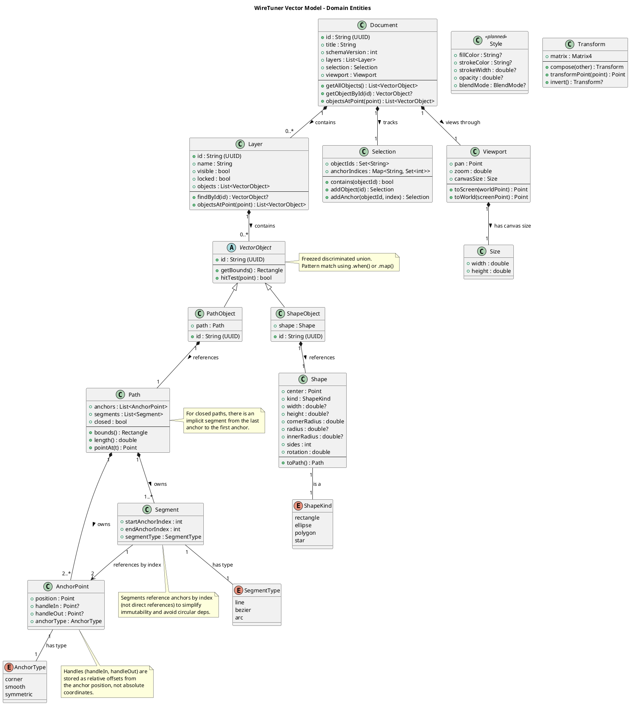

# Vector Model Specification

<!-- anchor: vector-model-specification -->

**Version:** 1.0
**Date:** 2025-11-08
**Status:** Active
**Related Documents:** [Event Schema Reference](event_schema.md) | [Data Snapshot ERD](../diagrams/data_snapshot_erd.md) | [System Structure and Data Model](../../.codemachine/artifacts/architecture/03_System_Structure_and_Data.md#data-model)

---

## Overview

This document provides the authoritative specification for WireTuner's immutable vector domain model. The vector model represents the in-memory document structure that is reconstructed from events during application runtime.

**Key Design Principles:**

1. **Immutability**: All domain objects are immutable; modifications create new instances using `copyWith` methods
2. **Event Sourcing Integration**: Model structures align with event payloads for deterministic reconstruction
3. **Freezed Code Generation**: Core aggregates leverage Freezed for automatic immutability, equality, and JSON serialization
4. **Snapshot Compatibility**: All entities support JSON serialization for snapshot persistence (gzip-compressed, stored every 1000 events)
5. **Rendering Order Determinism**: Layers and objects maintain explicit ordering for consistent visual output

---

## Table of Contents

- [Universal Concepts](#universal-concepts)
  - [Immutability and copyWith Patterns](#immutability-and-copywith-patterns)
  - [Coordinate Systems and Units](#coordinate-systems-and-units)
  - [UUID Identifiers](#uuid-identifiers)
- [Core Aggregates](#core-aggregates)
  - [Document](#document)
  - [Layer](#layer)
  - [VectorObject](#vectorobject)
- [Geometry Primitives](#geometry-primitives)
  - [Path](#path)
  - [Shape](#shape)
  - [Segment](#segment)
  - [AnchorPoint](#anchorpoint)
- [Visual Properties](#visual-properties)
  - [Style](#style)
  - [Transform](#transform)
- [UI State](#ui-state)
  - [Selection](#selection)
  - [Viewport](#viewport)
- [Data Model Diagram](#data-model-diagram)
- [JSON Serialization Examples](#json-serialization-examples)
- [Cross-References](#cross-references)

---

## Universal Concepts

### Immutability and copyWith Patterns

All domain objects follow the immutability pattern enforced by Dart's `@immutable` annotation or Freezed code generation. Modifications always create new instances rather than mutating existing objects.

**Standard copyWith Pattern:**
```dart
// Modify a path by adding an anchor
final newAnchors = [...path.anchors, newAnchor];
final updatedPath = path.copyWith(anchors: newAnchors);
```

**Nullable Field Handling:**
For nullable fields (e.g., `handleIn`, `handleOut` on `AnchorPoint`), use the **function wrapper pattern** to distinguish between "don't change" and "set to null":

```dart
// Set handleIn to null (remove handle)
final updated = anchor.copyWith(
  handleIn: () => null,
);

// Leave handleIn unchanged, update position
final moved = anchor.copyWith(
  position: Point(x: 20, y: 20),
);
```

### Coordinate Systems and Units

**World Coordinates:** All model positions (`Point.x`, `Point.y`) are in world-space units (typically pixels at 100% zoom). The origin (0, 0) is at the top-left of the infinite canvas.

**Screen Coordinates:** Viewport transformations (`Viewport.toScreen`, `Viewport.toWorld`) convert between world space and screen pixel coordinates, accounting for pan and zoom.

**Relative Offsets:** Anchor handles (`handleIn`, `handleOut`) are stored as relative offsets from the anchor's position, not absolute coordinates.

### UUID Identifiers

All object IDs (`Document.id`, `Layer.id`, `VectorObject.id`, etc.) use UUIDv4 format as defined in [RFC 4122](https://tools.ietf.org/html/rfc4122). This ensures globally unique identifiers across documents and sessions.

**Example:** `550e8400-e29b-41d4-a716-446655440000`

**Requirement:** IDs in event payloads and model instances must match exactly to enable event replay and snapshot reconstruction.

---

## Core Aggregates

### Document

<!-- anchor: vector-model-document -->

The root aggregate representing an entire vector document. Documents contain layers, manage global selection state, and persist viewport settings.

**Location:** `lib/domain/document/document.dart`

#### Fields

| Field Name | Type | Required | Immutability | Description |
|------------|------|----------|--------------|-------------|
| `id` | string (UUID) | Yes | Immutable | Unique identifier for this document; matches `documentId` in event envelopes |
| `title` | string | Yes | Immutable | Display name for the document; shown in UI and file system |
| `schemaVersion` | integer | Yes | Immutable | Schema version for serialization migrations; current value: `kDocumentSchemaVersion = 1` |
| `layers` | List&lt;Layer&gt; | Yes | Immutable | Ordered list of layers; rendered bottom-to-top (first layer is bottom-most) |
| `selection` | Selection | Yes | Immutable | Current selection state (selected objects and anchor indices) |
| `viewport` | Viewport | Yes | Immutable | Current viewport state (pan, zoom, canvas size) |

#### Rendering Order

Layers are rendered in array order: `layers[0]` is the bottom-most layer, `layers[n-1]` is the top-most. Within each layer, objects render in their array order. This deterministic ordering ensures consistent visual output during replay.

#### Query Methods

- `getAllObjects()` - Returns all VectorObjects from all layers in rendering order (bottom-to-top)
- `getObjectById(id)` - Finds an object by ID across all layers; returns null if not found
- `getLayerContainingObject(id)` - Returns the layer containing the specified object ID
- `objectsAtPoint(point)` - Returns objects at given point in reverse rendering order (top-most first)
- `objectsInBounds(bounds)` - Returns objects whose bounds intersect the given rectangle
- `getSelectedObjects()` - Returns all selected objects in rendering order

#### Snapshot Serialization

Documents serialize to JSON snapshots using Freezed's automatic JSON serialization. The `schemaVersion` field enables future migrations when the document structure evolves.

**Snapshot Cadence:** Every 1000 events (see [Event Schema - Snapshot Policy](event_schema.md#snapshot-policy))

**Storage Format:** gzip-compressed JSON BLOB in SQLite `snapshots` table

#### copyWith Usage

```dart
// Update document title
final renamed = doc.copyWith(title: 'New Title');

// Add a layer
final withNewLayer = doc.copyWith(
  layers: [...doc.layers, newLayer],
);

// Update selection
final selected = doc.copyWith(
  selection: doc.selection.addObject('path-123'),
);
```

---

### Layer

<!-- anchor: vector-model-layer -->

A layer is a collection of vector objects with visibility and locking properties. Layers provide organizational structure for complex documents.

**Location:** `lib/domain/document/document.dart` (co-located with Document)

#### Fields

| Field Name | Type | Required | Immutability | Description |
|------------|------|----------|--------------|-------------|
| `id` | string (UUID) | Yes | Immutable | Unique identifier for this layer |
| `name` | string | Yes | Immutable | Display name shown in layers panel; defaults to `'Layer'` |
| `visible` | boolean | Yes | Immutable | Whether layer is rendered in viewport; defaults to `true` |
| `locked` | boolean | Yes | Immutable | Whether layer is locked for editing; locked layers cannot be selected or modified; defaults to `false` |
| `objects` | List&lt;VectorObject&gt; | Yes | Immutable | Ordered list of vector objects; first object is bottom-most within the layer |

#### Rendering Behavior

**Visibility:** Invisible layers (`visible: false`) are not rendered but remain in the document. They are excluded from hit-testing and viewport culling.

**Locking:** Locked layers (`locked: true`) are visible but cannot be selected or modified. They are excluded from `Document.objectsAtPoint()` queries.

#### Query Methods

- `allObjects` - Returns all objects in rendering order
- `findById(objectId)` - Finds an object by ID; returns null if not found
- `objectsAtPoint(point)` - Returns objects that intersect the point (in reverse order, top-most first)
- `objectsInBounds(bounds)` - Returns objects whose bounds intersect the rectangle

#### copyWith Usage

```dart
// Toggle visibility
final hidden = layer.copyWith(visible: false);

// Rename layer
final renamed = layer.copyWith(name: 'Background');

// Add an object
final withObject = layer.copyWith(
  objects: [...layer.objects, newPath],
);
```

---

### VectorObject

<!-- anchor: vector-model-vectorobject -->

A discriminated union representing either a Path or a Shape. VectorObject enables polymorphic storage while maintaining type safety and immutability.

**Location:** `lib/domain/document/document.dart`

#### Design Rationale

Uses Freezed's union types instead of class inheritance to:
- Maintain full immutability (no mutable base class state)
- Enable exhaustive pattern matching
- Simplify JSON serialization
- Avoid vtable overhead

#### Variants

**PathObject:**
| Field | Type | Description |
|-------|------|-------------|
| `id` | string (UUID) | Unique identifier for this object |
| `path` | Path | The path data (anchors, segments, closed flag) |

**ShapeObject:**
| Field | Type | Description |
|-------|------|-------------|
| `id` | string (UUID) | Unique identifier for this object |
| `shape` | Shape | The parametric shape data (kind, center, dimensions) |

#### Pattern Matching

```dart
// Extract bounds using pattern matching
final bounds = vectorObj.when(
  path: (id, path) => path.bounds(),
  shape: (id, shape) => shape.toPath().bounds(),
);

// Type-specific operations
vectorObj.map(
  path: (pathObj) => print('Path has ${pathObj.path.anchors.length} anchors'),
  shape: (shapeObj) => print('Shape is ${shapeObj.shape.kind}'),
);
```

#### Common Methods

- `getBounds()` - Returns bounding rectangle (delegates to path/shape)
- `hitTest(point)` - Returns true if point is within object bounds (simple bounds-based test)

#### JSON Serialization

Freezed automatically includes a discriminator field (`runtimeType`) to distinguish between PathObject and ShapeObject during deserialization.

---

## Geometry Primitives

### Path

<!-- anchor: vector-model-path -->

An immutable vector path composed of anchor points and segments. Paths are the fundamental curve primitive in WireTuner.

**Location:** `lib/domain/models/path.dart`

#### Fields

| Field Name | Type | Required | Immutability | Description |
|------------|------|----------|--------------|-------------|
| `anchors` | List&lt;AnchorPoint&gt; | Yes | Immutable | Ordered list of anchor points defining positions and control points |
| `segments` | List&lt;Segment&gt; | Yes | Immutable | Ordered list of segments connecting anchors (by index); typically `anchors.length - 1` for open paths |
| `closed` | boolean | Yes | Immutable | Whether the path loops back to the start; closed paths have an implicit segment from last anchor to first; defaults to `false` |

#### Path Structure Invariants

1. **Anchor Ownership:** Paths own the authoritative list of AnchorPoint objects; segments reference anchors by index
2. **Implicit Closing Segment:** For closed paths with n anchors, there are effectively n segments (n-1 explicit + 1 implicit from last to first)
3. **Index Validity:** Segment indices (`startAnchorIndex`, `endAnchorIndex`) must be valid indices into the `anchors` list (not validated at construction, but enforced during geometric operations)

#### Geometric Operations

- `bounds()` - Returns control point bounding rectangle (includes all anchor positions and handle absolute positions)
- `length()` - Returns total arc length (approximated for Bezier segments using 10 subdivisions)
- `pointAt(t)` - Returns point at normalized parameter t ∈ [0, 1] along the path

#### Handle Coordinates

Anchor handles (`handleIn`, `handleOut`) are stored as **relative offsets** from the anchor position, not absolute canvas coordinates. Geometric calculations must convert to absolute positions:

```dart
final anchor = path.anchors[0];
final handleOutAbsolute = anchor.position + anchor.handleOut!;
```

#### copyWith Usage

```dart
// Add an anchor
final withAnchor = path.copyWith(
  anchors: [...path.anchors, newAnchor],
  segments: [...path.segments, Segment.line(startIndex: path.anchors.length - 1, endIndex: path.anchors.length)],
);

// Close the path
final closed = path.copyWith(closed: true);
```

#### Factory Constructors

- `Path.empty()` - Creates an empty path with no anchors or segments
- `Path.fromAnchors(anchors, closed)` - Creates a path with automatic line segments connecting consecutive anchors
- `Path.line(start, end)` - Creates a simple two-point line path

---

### Shape

<!-- anchor: vector-model-shape -->

An immutable parametric shape (rectangle, ellipse, polygon, or star) defined by geometric parameters rather than explicit anchor points.

**Location:** `lib/domain/models/shape.dart`

#### Fields

| Field Name | Type | Required | Immutability | Description |
|------------|------|----------|--------------|-------------|
| `center` | Point | Yes | Immutable | Center point of the shape in world coordinates |
| `kind` | ShapeKind | Yes | Immutable | Type of shape: `rectangle`, `ellipse`, `polygon`, or `star` |
| `width` | double? | Conditional | Immutable | Width for rectangle/ellipse; required for `kind: rectangle` or `ellipse` |
| `height` | double? | Conditional | Immutable | Height for rectangle/ellipse; required for `kind: rectangle` or `ellipse` |
| `cornerRadius` | double | No | Immutable | Corner radius for rectangles (0 = sharp corners); defaults to `0` |
| `radius` | double? | Conditional | Immutable | Radius for polygon/star outer points; required for `kind: polygon` or `star` |
| `innerRadius` | double? | Conditional | Immutable | Inner radius for stars; required for `kind: star` |
| `sides` | integer | Yes | Immutable | Number of sides (polygon) or points (star); defaults to `5` |
| `rotation` | double | Yes | Immutable | Rotation angle in radians; defaults to `0` |

#### ShapeKind Enumeration

- `rectangle` - Rectangle with optional rounded corners
- `ellipse` - Ellipse (or circle when width equals height)
- `polygon` - Regular polygon with configurable number of sides (minimum 3)
- `star` - Star shape with inner and outer radii

#### Parametric vs. Generated Paths

Shapes are stored in parametric form to enable intuitive editing:
- Rectangle width/height can be resized without recreating all anchors
- Star point count can be adjusted dynamically
- Ellipses maintain perfect circular symmetry

**Conversion:** Call `toPath()` to generate the explicit Path representation for rendering or geometric operations.

#### Invariants

1. **Positive Dimensions:** `width`, `height`, `radius`, `innerRadius` must be positive
2. **Corner Radius Bounds:** For rectangles, `cornerRadius ≤ min(width/2, height/2)`
3. **Star Radii Ordering:** For stars, `innerRadius < outerRadius`
4. **Minimum Sides:** Polygons and stars require `sides ≥ 3`

#### Path Conversion

```dart
final shape = Shape.rectangle(
  center: Point(x: 100, y: 100),
  width: 200,
  height: 150,
  cornerRadius: 10,
);

// Convert to path for rendering
final path = shape.toPath();
// Returns a closed path with 8 anchors (rounded corners use Bezier curves)
```

#### Factory Constructors

- `Shape.rectangle(center, width, height, cornerRadius, rotation)` - Creates a rectangle
- `Shape.ellipse(center, width, height, rotation)` - Creates an ellipse
- `Shape.polygon(center, radius, sides, rotation)` - Creates a regular polygon
- `Shape.star(center, outerRadius, innerRadius, pointCount, rotation)` - Creates a star

---

### Segment

<!-- anchor: vector-model-segment -->

An immutable segment connecting two anchor points by index. Segments define how anchors are connected (line or Bezier curve).

**Location:** `lib/domain/models/segment.dart`

#### Fields

| Field Name | Type | Required | Immutability | Description |
|------------|------|----------|--------------|-------------|
| `startAnchorIndex` | integer | Yes | Immutable | Index of the start anchor in the path's `anchors` list |
| `endAnchorIndex` | integer | Yes | Immutable | Index of the end anchor in the path's `anchors` list |
| `segmentType` | SegmentType | Yes | Immutable | Type of connection: `line`, `bezier`, or `arc` (arc is a future enhancement) |

#### SegmentType Enumeration

- `line` - Straight line segment (ignores control points)
- `bezier` - Cubic Bezier curve using `startAnchor.handleOut` and `endAnchor.handleIn` as control points
- `arc` - Circular arc segment (placeholder for future implementation)

#### Design Rationale: Index-Based References

Segments store **anchor indices** (not AnchorPoint references) to:
- Avoid circular dependencies
- Simplify immutability (no need to update segment references when anchors change)
- Enable efficient anchor list mutations (add/remove anchors by index)

#### Bezier Control Points

For Bezier segments, the actual control points come from the anchors' handles:
- **Control Point 1:** `anchors[startAnchorIndex].handleOut` (absolute position: `anchor.position + handleOut`)
- **Control Point 2:** `anchors[endAnchorIndex].handleIn` (absolute position: `anchor.position + handleIn`)

If handles are null, the segment degrades to a straight line.

#### Factory Constructors

- `Segment.line(startIndex, endIndex)` - Creates a straight line segment
- `Segment.bezier(startIndex, endIndex)` - Creates a Bezier curve segment

---

### AnchorPoint

<!-- anchor: vector-model-anchorpoint -->

An immutable anchor point in a vector path, defining a vertex position and optional Bezier control point handles.

**Location:** `lib/domain/models/anchor_point.dart`

#### Fields

| Field Name | Type | Required | Immutability | Description |
|------------|------|----------|--------------|-------------|
| `position` | Point | Yes | Immutable | Anchor position in world coordinates |
| `handleIn` | Point? | No | Immutable | Incoming Bezier control point (BCP) as a **relative offset** from `position`; null indicates no incoming curve control |
| `handleOut` | Point? | No | Immutable | Outgoing Bezier control point (BCP) as a **relative offset** from `position`; null indicates no outgoing curve control |
| `anchorType` | AnchorType | Yes | Immutable | Type defining handle behavior: `corner`, `smooth`, or `symmetric`; defaults to `corner` |

#### AnchorType Enumeration

- `corner` - Handles are independent (or absent); allows sharp corners or asymmetric curves
- `smooth` - Handles are mirrored (same angle, same magnitude); creates smooth flowing curves
- `symmetric` - Handles are collinear (opposite angles, different lengths); creates smooth curves with different curvature on each side

#### Handle Semantics: Relative Offsets

Handles are stored as **relative offsets** from the anchor position, not absolute canvas coordinates. This design choice:
- Simplifies anchor translation (moving an anchor doesn't require updating handle positions)
- Matches common vector editing tools (Illustrator, Figma)
- Aligns with Bezier curve mathematics (control points relative to endpoints)

**Example:**
```dart
final anchor = AnchorPoint(
  position: Point(x: 100, y: 100),
  handleOut: Point(x: 50, y: 0),  // 50 units to the right
);
// Absolute position of handleOut: (150, 100)
```

#### Handle Mirroring (Smooth Anchors)

For `anchorType: smooth`, editing one handle automatically mirrors the other:
- If `handleOut` is set to `Point(x: 20, y: 10)`, then `handleIn` becomes `Point(x: -20, y: -10)`
- This constraint is enforced by the `AnchorPoint.smooth()` factory and must be maintained when using `copyWith`

#### copyWith Pattern for Handles

To explicitly set a handle to null (remove it), use the function wrapper pattern:

```dart
// Remove handleIn (set to null)
final updated = anchor.copyWith(
  handleIn: () => null,
);

// Update position without changing handles
final moved = anchor.copyWith(
  position: Point(x: 60, y: 60),
);
```

#### Factory Constructors

- `AnchorPoint.corner(position)` - Creates a sharp corner anchor with no handles
- `AnchorPoint.smooth(position, handleOut)` - Creates a smooth anchor with symmetric handles (automatically sets `handleIn = -handleOut`)

---

## Visual Properties

### Style

<!-- anchor: vector-model-style -->

Represents visual styling properties for vector objects (fill, stroke, opacity). While a dedicated `Style` class is planned, current implementations use event payloads and inline properties.

**Status:** Partial implementation (properties defined in `ModifyStyleEvent`)

**Location:** `lib/domain/events/style_events.dart` (event definitions)

#### Intended Fields

| Field Name | Type | Required | Immutability | Description |
|------------|------|----------|--------------|-------------|
| `fillColor` | string? | No | Immutable | Fill color as hex string (e.g., `"#FF5733"`); null indicates no fill |
| `strokeColor` | string? | No | Immutable | Stroke color as hex string (e.g., `"#000000"`); null indicates no stroke |
| `strokeWidth` | double? | No | Immutable | Stroke width in pixels; must be ≥ 0; null uses default (1.0) |
| `opacity` | double? | No | Immutable | Opacity value in range [0.0, 1.0]; 0.0 = fully transparent, 1.0 = fully opaque; null uses default (1.0) |
| `blendMode` | BlendMode? | No | Immutable | Blend mode for compositing (future enhancement) |

#### Event Integration

Style modifications are captured by `ModifyStyleEvent`, which includes all style fields as optional properties. This enables partial updates (e.g., change only `fillColor` without affecting `strokeWidth`).

#### Future Work

A dedicated `Style` class will be implemented in Iteration 3 (I3) to:
- Store style properties directly on VectorObject instances
- Enable style presets and reusable style definitions
- Support advanced properties (gradients, patterns, blend modes)

---

### Transform

<!-- anchor: vector-model-transform -->

An immutable 2D affine transformation wrapping a `Matrix4` for translate, rotate, scale, and skew operations.

**Location:** `lib/domain/models/transform.dart`

#### Fields

| Field Name | Type | Required | Immutability | Description |
|------------|------|----------|--------------|-------------|
| `matrix` | Matrix4 | Yes | Immutable | Underlying transformation matrix from `vector_math` package; stored as a 4×4 matrix for homogeneous coordinates |

#### Supported Operations

- **Translate:** Offset by (dx, dy)
- **Rotate:** Rotate by angle in radians (counter-clockwise)
- **Scale:** Scale by factors (sx, sy)
- **Skew:** Skew by angles in radians
- **Compose:** Combine transformations via matrix multiplication

#### Transformation Order

Order matters! `t1.compose(t2)` applies `t1` first, then `t2`.

**Example:**
```dart
final t1 = Transform.translate(10, 0);
final t2 = Transform.scale(2, 1);
final combined = t1.compose(t2);

// Transforms point (5, 0):
// 1. Translate: (5, 0) → (15, 0)
// 2. Scale: (15, 0) → (30, 0)
```

#### Coordinate Transformations

- `transformPoint(point)` - Applies transformation to a point
- `transformRectangle(rect)` - Transforms rectangle (returns axis-aligned bounding box of transformed corners)
- `invert()` - Returns inverse transformation (or null if not invertible)

#### Extraction Methods

- `translation` - Extracts (dx, dy) as a Point
- `rotation` - Extracts rotation angle in radians
- `scale` - Extracts (scaleX, scaleY) as a Point

#### Factory Constructors

- `Transform.identity()` - No transformation
- `Transform.translate(dx, dy)` - Translation
- `Transform.rotate(angleInRadians)` - Rotation around origin
- `Transform.rotateAround(angle, center)` - Rotation around a specific point
- `Transform.scale(sx, sy)` - Non-uniform scale
- `Transform.uniformScale(scale)` - Uniform scale (same in x and y)
- `Transform.scaleAround(sx, sy, center)` - Scale around a specific point
- `Transform.skew(angleX, angleY)` - Skew transformation

#### Future Integration

Transforms will be applied to VectorObject instances in Iteration 3 (I3) to support rotation, scaling, and translation of objects independently of their anchor positions.

---

## UI State

### Selection

<!-- anchor: vector-model-selection -->

An immutable selection state tracking selected objects and anchor points. Selection is persisted in snapshots to enable undo/redo of selection changes.

**Location:** `lib/domain/document/selection.dart`

#### Fields

| Field Name | Type | Required | Immutability | Description |
|------------|------|----------|--------------|-------------|
| `objectIds` | Set&lt;string&gt; | Yes | Immutable | Set of selected object IDs (UUIDs); using a Set ensures uniqueness and O(1) lookup; defaults to empty set |
| `anchorIndices` | Map&lt;string, Set&lt;int&gt;&gt; | Yes | Immutable | Map of object ID to selected anchor indices (zero-based); enables direct selection for individual anchor manipulation; defaults to empty map |

#### Anchor Selection Structure

The `anchorIndices` map allows selecting individual anchor points within paths:

```dart
{
  'path-1': {0, 2, 5},  // Anchors 0, 2, 5 selected in path-1
  'path-2': {1},        // Anchor 1 selected in path-2
}
```

#### Query Methods

- `isEmpty` / `isNotEmpty` - Whether any objects are selected
- `selectedCount` - Number of selected objects
- `contains(objectId)` - Whether the object is selected
- `hasSelectedAnchors(objectId)` - Whether the object has anchor selections
- `getSelectedAnchors(objectId)` - Returns set of selected anchor indices for the object

#### Mutation Methods (Return New Instance)

- `addObject(id)` - Adds object to selection
- `addObjects(ids)` - Adds multiple objects
- `removeObject(id)` - Removes object (also clears anchor selections)
- `removeObjects(ids)` - Removes multiple objects
- `selectOnly(id)` - Replaces selection with single object
- `selectOnlyMultiple(ids)` - Replaces selection with multiple objects
- `clear()` - Clears all selections
- `addAnchor(objectId, anchorIndex)` - Adds anchor to object's selection
- `addAnchors(objectId, indices)` - Adds multiple anchors
- `removeAnchor(objectId, anchorIndex)` - Removes anchor from selection
- `clearAnchors()` - Clears all anchor selections
- `clearAnchorsForObject(objectId)` - Clears anchor selections for specific object

#### JSON Serialization

Freezed handles Set and Map serialization automatically, preserving selection state in snapshots.

---

### Viewport

<!-- anchor: vector-model-viewport -->

An immutable viewport state controlling how the document is viewed and providing coordinate transformations between world space and screen space.

**Location:** `lib/domain/document/document.dart` (co-located with Document)

#### Fields

| Field Name | Type | Required | Immutability | Description |
|------------|------|----------|--------------|-------------|
| `pan` | Point | Yes | Immutable | Pan offset in world coordinates; represents how much the view has been panned from the origin; defaults to `Point(x: 0, y: 0)` |
| `zoom` | double | Yes | Immutable | Zoom level (1.0 = 100%, 2.0 = 200%, 0.5 = 50%); must be positive; typical range is 0.1 to 10.0; defaults to `1.0` |
| `canvasSize` | Size | Yes | Immutable | Size of the canvas in screen pixels; represents the viewport dimensions; defaults to `Size(width: 800, height: 600)` |

#### Coordinate Transformations

**World to Screen:**
```dart
Point toScreen(Point worldPoint) {
  return Point(
    x: (worldPoint.x - pan.x) * zoom + canvasSize.width / 2,
    y: (worldPoint.y - pan.y) * zoom + canvasSize.height / 2,
  );
}
```

**Screen to World:**
```dart
Point toWorld(Point screenPoint) {
  return Point(
    x: (screenPoint.x - canvasSize.width / 2) / zoom + pan.x,
    y: (screenPoint.y - canvasSize.height / 2) / zoom + pan.y,
  );
}
```

#### Usage Examples

```dart
// Create viewport
final viewport = Viewport(
  pan: Point(x: 0, y: 0),
  zoom: 1.0,
  canvasSize: Size(width: 1920, height: 1080),
);

// Transform coordinates
final worldPoint = Point(x: 100, y: 200);
final screenPoint = viewport.toScreen(worldPoint);
final backToWorld = viewport.toWorld(screenPoint);
assert(worldPoint == backToWorld);
```

#### Event Integration

Viewport state changes are captured by `ViewportPanEvent` and `ViewportZoomEvent` (sampled at 50ms intervals during continuous navigation).

---

## Data Model Diagram

<!-- anchor: vector-model-diagram -->

The following PlantUML diagram illustrates the relationships between domain entities:



**Diagram Notes:**

1. **Immutability:** All entities are immutable; modifications use `copyWith` methods
2. **Rendering Order:** Layers and objects maintain explicit array ordering (bottom-to-top)
3. **Index-Based References:** Segments reference anchors by index, not direct object references
4. **Relative Handles:** Anchor handles are stored as offsets from anchor position
5. **Union Types:** VectorObject uses Freezed's discriminated union pattern (PathObject | ShapeObject)

---

## JSON Serialization Examples

<!-- anchor: vector-model-json-examples -->

### Example 1: Rectangle Path

A simple closed rectangular path with four corner anchors and line segments.

```json
{
  "id": "path-rect-001",
  "path": {
    "anchors": [
      {
        "position": {"x": 50.0, "y": 50.0},
        "handleIn": null,
        "handleOut": null,
        "anchorType": "corner"
      },
      {
        "position": {"x": 250.0, "y": 50.0},
        "handleIn": null,
        "handleOut": null,
        "anchorType": "corner"
      },
      {
        "position": {"x": 250.0, "y": 150.0},
        "handleIn": null,
        "handleOut": null,
        "anchorType": "corner"
      },
      {
        "position": {"x": 50.0, "y": 150.0},
        "handleIn": null,
        "handleOut": null,
        "anchorType": "corner"
      }
    ],
    "segments": [
      {
        "startAnchorIndex": 0,
        "endAnchorIndex": 1,
        "segmentType": "line"
      },
      {
        "startAnchorIndex": 1,
        "endAnchorIndex": 2,
        "segmentType": "line"
      },
      {
        "startAnchorIndex": 2,
        "endAnchorIndex": 3,
        "segmentType": "line"
      }
    ],
    "closed": true
  }
}
```

**Notes:**
- 4 corner anchors with no handles (null `handleIn`/`handleOut`)
- 3 explicit line segments + 1 implicit closing segment (from anchor 3 to anchor 0)
- `closed: true` creates the implicit closing segment
- All coordinates in world space

---

### Example 2: Bezier Curve Path

A smooth Bezier curve with two anchors and symmetric handles.

```json
{
  "id": "path-curve-002",
  "path": {
    "anchors": [
      {
        "position": {"x": 100.0, "y": 100.0},
        "handleIn": null,
        "handleOut": {"x": 50.0, "y": 0.0},
        "anchorType": "smooth"
      },
      {
        "position": {"x": 300.0, "y": 200.0},
        "handleIn": {"x": -50.0, "y": 0.0},
        "handleOut": null,
        "anchorType": "smooth"
      }
    ],
    "segments": [
      {
        "startAnchorIndex": 0,
        "endAnchorIndex": 1,
        "segmentType": "bezier"
      }
    ],
    "closed": false
  }
}
```

**Notes:**
- 2 smooth anchors with Bezier control point handles
- Handles stored as **relative offsets**: anchor 0's `handleOut` absolute position is (150, 100)
- 1 Bezier segment using handles for curve control
- `closed: false` - open path with no implicit closing segment
- Control points define a smooth S-curve

**Bezier Curve Formula:**
```
P(t) = (1-t)³·P₀ + 3(1-t)²t·P₁ + 3(1-t)t²·P₂ + t³·P₃

Where:
  P₀ = anchor[0].position = (100, 100)
  P₁ = anchor[0].position + anchor[0].handleOut = (150, 100)
  P₂ = anchor[1].position + anchor[1].handleIn = (250, 200)
  P₃ = anchor[1].position = (300, 200)
```

---

## Cross-References

### Architecture Documents

- [System Structure and Data Model - Domain Model ERD](../../.codemachine/artifacts/architecture/03_System_Structure_and_Data.md#data-model-domain-erd) - Visual representation of entity relationships
- [Design Rationale - Decision 1 (Event Sourcing)](../../.codemachine/artifacts/architecture/06_Rationale_and_Future.md#decision-event-sourcing) - Immutability and event reconstruction rationale
- [Design Rationale - Decision 3 (SQLite)](../../.codemachine/artifacts/architecture/06_Rationale_and_Future.md#decision-sqlite) - Snapshot storage format and schema versioning

### Event Schema Integration

- [Event Schema Reference](event_schema.md) - UUID format requirements, event type discriminators, and payload specifications
- [Event Schema - Universal Envelope](event_schema.md#universal-event-envelope) - Document ID and event sequence numbering
- [Event Schema - Snapshot Policy](event_schema.md#snapshot-policy) - 1000-event snapshot cadence and compression

### Diagrams

- [Data Snapshot ERD](../diagrams/data_snapshot_erd.md) - SQLite persistence schema (metadata, events, snapshots tables)
- [Domain Model Diagram](../../.codemachine/artifacts/architecture/03_System_Structure_and_Data.md#data-model-domain-erd) - PlantUML diagram of in-memory domain entities

### Implementation Files

- **Document Aggregates:** `lib/domain/document/document.dart` - Document, Layer, VectorObject, Viewport
- **Selection:** `lib/domain/document/selection.dart` - Selection state
- **Path:** `lib/domain/models/path.dart` - Path geometry
- **Shape:** `lib/domain/models/shape.dart` - Parametric shapes
- **Segment:** `lib/domain/models/segment.dart` - Segment definitions
- **AnchorPoint:** `lib/domain/models/anchor_point.dart` - Anchor point and handle semantics
- **Transform:** `lib/domain/models/transform.dart` - Affine transformations
- **Style Events:** `lib/domain/events/style_events.dart` - ModifyStyleEvent payload

---

**Document Maintainer:** WireTuner Architecture Team
**Last Updated:** 2025-11-08
**Next Review:** After completion of I3.T1 (Tool Agent Integration)
