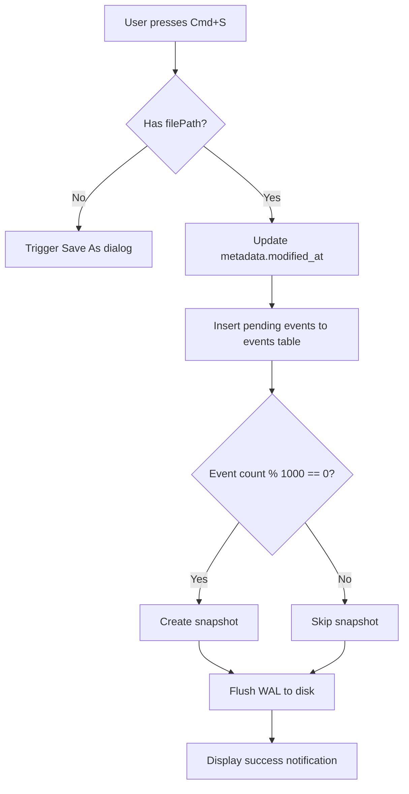
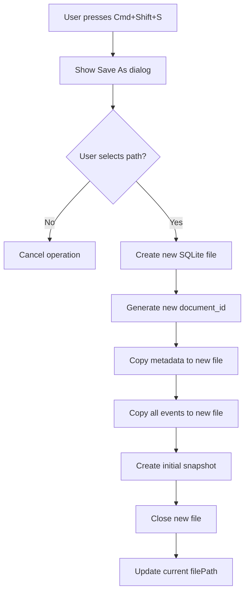
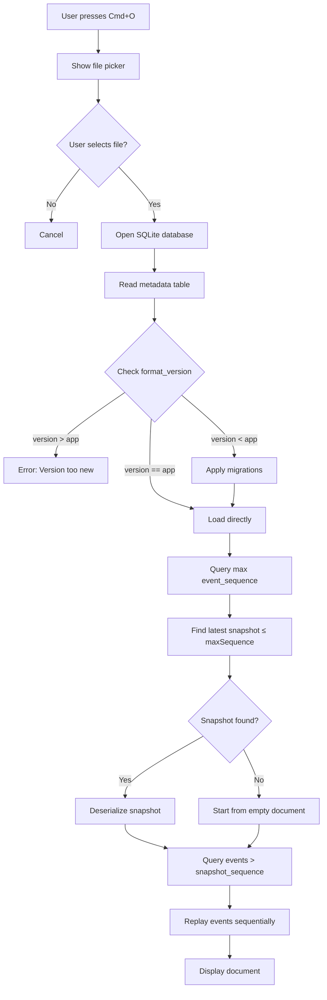

# WireTuner Persistence Contract

**Document Version:** 1.0
**Last Updated:** 2025-11-08
**Status:** Active
**Related ADR:** [003-event-sourcing-architecture.md](../adr/003-event-sourcing-architecture.md)
**Related API Spec:** [save_load.yaml](../../api/save_load.yaml)

---

## Table of Contents

1. [Overview](#overview)
2. [File Format Specification](#file-format-specification)
3. [Save Operations](#save-operations)
4. [Load Operations](#load-operations)
5. [Version Negotiation](#version-negotiation)
6. [Metadata Schema](#metadata-schema)
7. [Snapshot Strategy](#snapshot-strategy)
8. [Error Handling and Recovery](#error-handling-and-recovery)
9. [Performance Requirements](#performance-requirements)
10. [Security Considerations](#security-considerations)
11. [Testing Strategy](#testing-strategy)
12. [Future Enhancements](#future-enhancements)
13. [References](#references)

---

## Overview

This document defines the complete contract for document persistence in WireTuner, covering save/load operations, file format specifications, version negotiation, error handling, and recovery procedures. It serves as the normative specification for Iteration 5 (I5) persistence implementation tasks.

### Purpose

- **Normative Specification:** This contract is the authoritative source for implementing document I/O
- **Cross-Team Alignment:** Ensures UI, persistence, and event sourcing layers work together correctly
- **Quality Assurance:** Provides test scenarios and acceptance criteria for validation
- **Future-Proofing:** Establishes version negotiation and migration patterns for format evolution

### Scope

This contract covers:
- Document save/load workflows (Cmd+S, Save As, Open File)
- Auto-save behavior (background persistence)
- File format structure (SQLite schema, compression, encoding)
- Version negotiation (forward/backward compatibility)
- Error handling (corruption, disk full, permission errors)
- Recovery procedures (partial load, snapshot fallback)

This contract does NOT cover:
- Export operations (SVG, PDF) - see separate export specifications
- Collaborative editing - deferred to post-0.1 milestones
- Cloud sync - deferred to post-0.1 milestones

### Key Architectural Principles

1. **Event Sourcing Foundation:** All state changes captured as immutable events in append-only log
2. **Snapshot Optimization:** Periodic snapshots (every 1000 events) enable fast document loading
3. **Crash Resistance:** SQLite WAL mode + atomic transactions ensure durability
4. **Forward Compatibility:** App can always read older file format versions (with migrations)
5. **Graceful Degradation:** Corruption or errors trigger partial recovery, not total failure

---

## File Format Specification

### File Extension

**Primary Extension:** `.wiretuner` (all lowercase)

**Examples:**
- `my-drawing.wiretuner`
- `logo-design.wiretuner`
- `untitled.wiretuner`

**Alternative Extensions:** None. Do not use `.wtd`, `.wt`, or other variations.

### Internal Structure

**Format:** SQLite 3 database
**SQLite Version:** 3.x (minimum 3.35.0 for modern JSON support)
**Journal Mode:** WAL (Write-Ahead Logging) for crash resistance
**Encoding:** UTF-8
**Magic Bytes:** SQLite header (`53 51 4C 69 74 65 20 66 6F 72 6D 61 74 20 33 00`)

### MIME Type

**Proposed MIME Type:** `application/vnd.wiretuner+sqlite`
**Alternative:** `application/x-wiretuner`

**Rationale:**
- `vnd.` prefix indicates vendor-specific format
- `+sqlite` suffix documents underlying container format
- Aligns with RFC 6838 standards for MIME types

### Database Schema

The `.wiretuner` file contains three core tables:

#### 1. Metadata Table

Stores document-level information (one row per document).

```sql
CREATE TABLE metadata (
  document_id TEXT PRIMARY KEY,
  title TEXT NOT NULL,
  format_version INTEGER NOT NULL,
  created_at INTEGER NOT NULL,
  modified_at INTEGER NOT NULL,
  author TEXT
);
```

**Purpose:** Document identity, versioning, timestamps

#### 2. Events Table

Append-only event log for event sourcing.

```sql
CREATE TABLE events (
  event_id INTEGER PRIMARY KEY AUTOINCREMENT,
  document_id TEXT NOT NULL,
  event_sequence INTEGER NOT NULL,
  event_type TEXT NOT NULL,
  event_payload TEXT NOT NULL,
  timestamp INTEGER NOT NULL,
  user_id TEXT,
  FOREIGN KEY (document_id) REFERENCES metadata(document_id) ON DELETE CASCADE,
  UNIQUE(document_id, event_sequence),
  CHECK(json_valid(event_payload))
);

CREATE INDEX idx_events_document_sequence ON events(document_id, event_sequence);
```

**Purpose:** Sequential event log, deterministic replay

#### 3. Snapshots Table

Periodic document state captures for fast loading.

```sql
CREATE TABLE snapshots (
  snapshot_id INTEGER PRIMARY KEY AUTOINCREMENT,
  document_id TEXT NOT NULL,
  event_sequence INTEGER NOT NULL,
  snapshot_data BLOB NOT NULL,
  created_at INTEGER NOT NULL,
  compression TEXT NOT NULL,
  FOREIGN KEY (document_id) REFERENCES metadata(document_id) ON DELETE CASCADE
);

CREATE INDEX idx_snapshots_document ON snapshots(document_id, event_sequence DESC);
```

**Purpose:** Load optimization (avoid replaying thousands of events)

### File Size Estimates

| Document Type | Event Count | Snapshots | Typical Size |
|---------------|-------------|-----------|--------------|
| Empty document | 0 | 0 | ~50 KB (SQLite overhead) |
| Simple drawing | 100-500 | 0-1 | 100-200 KB |
| Typical document | 1000-3000 | 1-3 | 300-800 KB |
| Large document | 10000+ | 10+ | 2-10 MB |

**Compression Ratio:** ~10:1 (gzip on snapshots and event payloads)

### Platform Integration (Future)

| Platform | Integration Method | Status |
|----------|-------------------|--------|
| **macOS** | UTI (Uniform Type Identifier) via Info.plist | Planned for 0.2 |
| **Windows** | Registry entry + custom icon | Planned for 0.2 |
| **Linux** | .desktop file + MIME type mapping | Planned for 0.2 |

**Example UTI Declaration (macOS):**
```xml
<key>UTExportedTypeDeclarations</key>
<array>
  <dict>
    <key>UTTypeIdentifier</key>
    <string>dev.wiretuner.wiretuner-document</string>
    <key>UTTypeDescription</key>
    <string>WireTuner Document</string>
    <key>UTTypeConformsTo</key>
    <array>
      <string>public.database</string>
      <string>public.data</string>
    </array>
    <key>UTTypeTagSpecification</key>
    <dict>
      <key>public.filename-extension</key>
      <array>
        <string>wiretuner</string>
      </array>
    </dict>
  </dict>
</array>
```

### Comparison to Other Formats

| Format | Extension | Structure | Event Sourcing | Undo/Redo | Collaboration |
|--------|-----------|-----------|----------------|-----------|---------------|
| **WireTuner** | `.wiretuner` | SQLite | Yes | Unlimited | Planned |
| Adobe Illustrator | `.ai` | PDF-based | No | Limited (~100 steps) | No |
| Inkscape | `.svg` | XML | No | Session only | No |
| Figma | `.fig` | Proprietary binary | Yes | Unlimited | Yes (cloud) |
| Sketch | `.sketch` | ZIP + JSON | No | Limited | Cloud-based |

**Key Differentiators:**
- **WireTuner:** Full event sourcing with local-first persistence
- **Open Format:** SQLite is open, inspectable, queryable
- **Crash Resistant:** WAL mode ensures durability
- **Future-Proof:** Version negotiation supports format evolution

---

## Save Operations

### Save (Cmd+S / Ctrl+S)

**User Trigger:** Keyboard shortcut or File → Save menu item

**Behavior:**
1. **If document has filePath:** Overwrite existing file in-place
2. **If new document (no filePath):** Trigger "Save As..." dialog first

**Workflow:**



**Implementation Pseudocode:**

```dart
Future<void> saveDocument(String? filePath) async {
  if (filePath == null) {
    // New document - prompt for file path
    filePath = await showSaveDialog(defaultName: '${document.title}.wiretuner');
    if (filePath == null) return; // User cancelled
  }

  // Update metadata
  await db.execute('''
    UPDATE metadata
    SET modified_at = ?, title = ?
    WHERE document_id = ?
  ''', [DateTime.now().millisecondsSinceEpoch, document.title, document.id]);

  // Insert pending events
  for (final event in pendingEvents) {
    await eventStore.insertEvent(document.id, event);
  }

  // Check if snapshot threshold reached
  final maxSequence = await eventStore.getMaxSequence(document.id);
  if (maxSequence % 1000 == 0 && maxSequence > lastSnapshotSequence) {
    await snapshotManager.createSnapshot(document, maxSequence);
  }

  // Flush WAL
  await db.execute('PRAGMA wal_checkpoint(TRUNCATE)');
}
```

**Error Handling:**
- **Disk Full (SQLITE_FULL):** Display error, enter read-only mode, suggest freeing space
- **Permission Denied:** Display error, suggest alternate location
- **Write Failure:** Rollback transaction, preserve pending events in memory

**Performance Target:** < 100ms for typical save operation (< 1000 pending events)

---

### Save As... (Cmd+Shift+S / Ctrl+Shift+S)

**User Trigger:** Keyboard shortcut or File → Save As... menu item

**Behavior:** Always prompts for new file path, creating a complete copy of the document

**Use Cases:**
1. **Duplicate Document:** Create backup before major changes
2. **Version Upgrade:** Save in newer format version (future)
3. **Rename/Move:** Change document name or location

**Workflow:**



**Implementation Pseudocode:**

```dart
Future<void> saveDocumentAs() async {
  final newFilePath = await showSaveDialog(
    defaultName: '${document.title}.wiretuner',
    suggestedDirectory: path.dirname(currentFilePath),
  );
  if (newFilePath == null) return;

  // Create new database
  final newDb = await openDatabase(newFilePath);
  await SchemaManager.createSchema(newDb);

  // Generate new document ID
  final newDocId = Uuid().v4();

  // Copy metadata
  await newDb.insert('metadata', {
    'document_id': newDocId,
    'title': document.title,
    'format_version': kCurrentFormatVersion,
    'created_at': DateTime.now().millisecondsSinceEpoch,
    'modified_at': DateTime.now().millisecondsSinceEpoch,
    'author': null,
  });

  // Copy all events
  final allEvents = await eventStore.getEvents(document.id, fromSeq: 0);
  for (final event in allEvents) {
    await newDb.insert('events', {
      'document_id': newDocId,
      'event_sequence': event.sequence,
      'event_type': event.type,
      'event_payload': event.toJson(),
      'timestamp': event.timestamp,
    });
  }

  // Create initial snapshot
  await snapshotSerializer.serialize(document);
  await newDb.insert('snapshots', {...});

  // Update current document reference
  currentDocumentId = newDocId;
  currentFilePath = newFilePath;
}
```

**Error Handling:**
- **File Already Exists:** Prompt for overwrite confirmation
- **Disk Full:** Display error, abort operation
- **Copy Failure:** Rollback, delete partial file, display error

**Performance Target:** < 500ms (includes full event copy)

---

### Auto-Save (Background)

**Trigger:** Timer-based, every 30 seconds after first unsaved change

**Behavior:**
- Flush pending events to disk (append to event log)
- Do NOT create new file or prompt user
- Do NOT update `modified_at` timestamp (only manual save does)
- Do NOT create snapshots (only at 1000-event threshold)

**Implementation:**

```dart
class AutoSaveManager {
  Timer? _timer;
  bool _hasUnsavedChanges = false;

  void onEventRecorded() {
    if (!_hasUnsavedChanges) {
      _hasUnsavedChanges = true;
      _scheduleAutoSave();
    }
  }

  void _scheduleAutoSave() {
    _timer?.cancel();
    _timer = Timer(Duration(seconds: 30), _performAutoSave);
  }

  Future<void> _performAutoSave() async {
    if (currentFilePath == null) return; // Skip for new documents

    try {
      // Append pending events only
      for (final event in pendingEvents) {
        await eventStore.insertEvent(document.id, event);
      }
      pendingEvents.clear();
      _hasUnsavedChanges = false;
    } on SqliteException catch (e) {
      if (e.extendedResultCode == 13) { // SQLITE_FULL
        _logger.w('Auto-save failed: disk full');
        // Keep events in memory, user must manually save
      }
    }
  }
}
```

**User Visibility:** Silent background operation (no UI indication)

**Performance Target:** < 50ms (should not block UI)

**Failure Handling:**
- **Disk Full:** Log warning, preserve events in memory, continue editing
- **Write Error:** Retry once after 5 seconds, then log error

---

## Load Operations

### Open File (Cmd+O / Ctrl+O)

**User Trigger:** Keyboard shortcut or File → Open menu item

**Behavior:** Prompt for `.wiretuner` file, then load via full replay workflow

**Workflow:**



**Implementation Pseudocode:**

```dart
Future<Document> loadDocument(String filePath) async {
  // Step 1: Open database
  final db = await openDatabase(filePath);

  // Step 2: Read metadata
  final metadata = await db.query('metadata', limit: 1);
  final formatVersion = metadata.first['format_version'] as int;

  // Step 3: Version check
  if (formatVersion > kCurrentFormatVersion) {
    throw VersionMismatchException(
      'This document requires WireTuner v${formatVersion / 10} or later. '
      'Current app version is v${kCurrentFormatVersion / 10}.',
    );
  } else if (formatVersion < kCurrentFormatVersion) {
    await _applyMigrations(db, formatVersion, kCurrentFormatVersion);
  }

  // Step 4: Query max event sequence
  final maxSeq = await eventStore.getMaxSequence(documentId);

  // Step 5: Find latest snapshot
  final snapshot = await snapshotStore.getLatestSnapshot(documentId, maxSeq);

  // Step 6: Deserialize snapshot (or start from empty)
  Document document;
  int replayFromSeq;

  if (snapshot != null) {
    document = snapshotSerializer.deserialize(snapshot.data);
    replayFromSeq = snapshot.eventSequence + 1;
  } else {
    document = Document.empty(id: documentId);
    replayFromSeq = 0;
  }

  // Step 7: Replay events
  final events = await eventStore.getEvents(
    documentId,
    fromSeq: replayFromSeq,
    toSeq: maxSeq,
  );

  for (final event in events) {
    document = eventDispatcher.apply(document, event);
  }

  return document;
}
```

**Error Handling:**
- **File Not Found:** Display error with recovery options (check moved/deleted)
- **Version Mismatch:** Display error with upgrade instructions
- **Snapshot Corruption:** Fallback to previous snapshot, warn user
- **Event Corruption:** Halt at corrupted event, offer partial load

**Performance Target:** < 200ms (snapshot + up to 1000 event replays)

---

### Quick Open / Recent Files

**User Trigger:** File → Open Recent submenu

**Behavior:** Same as "Open File" but skips file picker (uses stored path)

**Additional Checks:**
1. **File Still Exists:** Verify file at stored path before attempting load
2. **File Moved:** If missing, remove from recent files list and display error

**Implementation:**

```dart
Future<void> openRecentFile(String filePath) async {
  if (!File(filePath).existsSync()) {
    await recentFilesManager.remove(filePath);
    throw FileNotFoundException(
      'File not found: $filePath. '
      'The file may have been moved, renamed, or deleted.',
    );
  }

  await loadDocument(filePath);
}
```

---

## Version Negotiation

### Version Fields

WireTuner uses **two separate version fields** to track compatibility:

| Field | Location | Purpose | Scope |
|-------|----------|---------|-------|
| **`format_version`** | `metadata` table | File format compatibility | SQLite schema, table structure |
| **`schemaVersion`** | `Document` JSON | Document model compatibility | Domain object structure |

**Rationale:**
- File format and document model can evolve independently
- File format v1 can contain document schema v2 (new fields added)
- File format v2 (new tables) can still use document schema v1

### Version History

| Format Version | Document Schema | Released | Changes |
|----------------|-----------------|----------|---------|
| **1** | 1 | Milestone 0.1 (2024-Q4) | Initial release (event sourcing, snapshots) |
| **2** | 1 or 2 | Milestone 0.2 (planned) | Add collaboration tables (users, permissions) |

### Compatibility Matrix

| App Version | Can Read File Versions | Can Write File Versions | Migrations Required |
|-------------|------------------------|-------------------------|---------------------|
| **0.1** | v1 | v1 | None |
| **0.2** (future) | v1, v2 | v2 | v1 → v2 (add collaboration tables) |
| **1.0** (future) | v1, v2, v3 | v3 | v1 → v2 → v3 (sequential) |

### Forward Compatibility (Reading Older Files)

**Principle:** App can ALWAYS read older file format versions

**Implementation:**

```dart
Future<void> _applyMigrations(Database db, int fromVersion, int toVersion) async {
  for (int v = fromVersion; v < toVersion; v++) {
    switch (v) {
      case 1:
        await _migrateV1toV2(db);
        break;
      case 2:
        await _migrateV2toV3(db);
        break;
      default:
        throw UnsupportedError('Unknown migration path: v$v -> v${v+1}');
    }
  }

  // Update format_version in metadata
  await db.execute('UPDATE metadata SET format_version = ?', [toVersion]);
}

Future<void> _migrateV1toV2(Database db) async {
  // Example: Add collaboration tables for v2
  await db.execute('''
    CREATE TABLE users (
      user_id TEXT PRIMARY KEY,
      name TEXT NOT NULL,
      email TEXT NOT NULL
    )
  ''');

  await db.execute('''
    CREATE TABLE permissions (
      document_id TEXT NOT NULL,
      user_id TEXT NOT NULL,
      role TEXT NOT NULL,
      PRIMARY KEY (document_id, user_id)
    )
  ''');
}
```

**Migration Triggers:**
- **On Load:** Detect `format_version < kCurrentFormatVersion`, apply migrations
- **Automatic:** Migrations applied transparently (user not prompted)
- **Logged:** Migration steps logged for debugging

### Backward Compatibility (Reading Newer Files)

**Principle:** App CANNOT read newer file format versions

**Implementation:**

```dart
if (formatVersion > kCurrentFormatVersion) {
  throw VersionMismatchException(
    'This document requires WireTuner v${_formatVersionToAppVersion(formatVersion)} or later.\n'
    'Current app version: v${_formatVersionToAppVersion(kCurrentFormatVersion)}.\n\n'
    'Please upgrade WireTuner to open this file.',
  );
}
```

**User Experience:**
- Display modal error dialog with upgrade instructions
- Provide link to download latest version
- Offer to export partial content if possible (graceful degradation)

### Version Upgrade (User-Initiated)

**Trigger:** User explicitly chooses "Save As..." with "Upgrade Format" checkbox

**Workflow:**
1. User selects File → Save As...
2. Dialog includes checkbox: "Upgrade to latest format version (v2)"
3. If checked: Create new file with `format_version = kCurrentFormatVersion`
4. Copy all events and snapshots to new file
5. Apply format-specific transformations (if needed)

**Use Cases:**
- Prepare document for sharing with users on older app versions
- Upgrade legacy documents to take advantage of new features
- Force consistency across team (all documents on same format version)

### Breaking vs. Non-Breaking Changes

| Change Type | Version Increment | Examples |
|-------------|-------------------|----------|
| **Breaking** | `format_version++` | New required tables, renamed columns, incompatible event types |
| **Non-Breaking** | `schemaVersion++` | New optional fields, additional event types, new indexes |

**Guidelines:**
- **Breaking changes:** Require migration, increment `format_version`
- **Non-breaking changes:** Backward compatible, increment `schemaVersion` only
- **Deprecation:** Mark old fields as deprecated before removal (2-version grace period)

---

## Metadata Schema

### Fields

| Field | Type | Required | Default | Description |
|-------|------|----------|---------|-------------|
| **`document_id`** | TEXT | Yes | (generated) | Unique document identifier (UUID v4) |
| **`title`** | TEXT | Yes | "Untitled" | Document title (user-editable) |
| **`format_version`** | INTEGER | Yes | 1 | File format version for compatibility |
| **`created_at`** | INTEGER | Yes | (generated) | Unix timestamp (ms) when first saved |
| **`modified_at`** | INTEGER | Yes | (generated) | Unix timestamp (ms) of last manual save |
| **`author`** | TEXT | No | NULL | Author name (reserved for future use) |

### Field Details

#### `document_id`

**Format:** UUID v4 (36 characters with hyphens)
**Example:** `doc-a1b2c3d4-e5f6-7890-abcd-ef1234567890`

**Generation:**

```dart
import 'package:uuid/uuid.dart';

final documentId = 'doc-${Uuid().v4()}';
```

**Uniqueness:** Globally unique across all documents

**Purpose:**
- Primary key for metadata table
- Foreign key reference for events and snapshots
- Enables document merging for future collaboration features

#### `title`

**Format:** UTF-8 string (max 255 characters)
**Example:** `"Logo Design"`, `"Untitled"`

**Validation:**
- Must not be empty
- Trim leading/trailing whitespace
- Replace newlines with spaces

**User Editing:**
- Editable in File → Document Properties dialog
- Automatically set from file name on first save
- Displayed in window title and recent files list

#### `format_version`

**Format:** Integer (positive)
**Current Value:** `1` (Milestone 0.1)

**Purpose:**
- Determines file format compatibility
- Triggers migrations on load
- Prevents opening files with incompatible formats

**Version Mapping:**

```dart
const int kFormatVersionV1 = 1; // Milestone 0.1
const int kFormatVersionV2 = 2; // Milestone 0.2 (planned)
const int kCurrentFormatVersion = kFormatVersionV1;
```

#### `created_at` and `modified_at`

**Format:** Integer (Unix timestamp in milliseconds)
**Example:** `1699564800000` (2023-11-10 00:00:00 UTC)

**Generation:**

```dart
final timestamp = DateTime.now().millisecondsSinceEpoch;
```

**Update Rules:**
- `created_at`: Set once on first save, never modified
- `modified_at`: Updated on every manual save (Cmd+S, Save As)
- `modified_at`: NOT updated on auto-save (background persistence)

**Display:**

```dart
final modifiedDate = DateTime.fromMillisecondsSinceEpoch(modifiedAt);
final formatted = DateFormat('MMM d, yyyy h:mm a').format(modifiedDate);
// Output: "Nov 10, 2023 3:45 PM"
```

#### `author`

**Format:** TEXT (nullable)
**Current Value:** `NULL` (Milestone 0.1)

**Future Use:**
- Store author name for collaboration features
- Display in document properties and version history
- Used for attribution in multi-user editing

---

## Snapshot Strategy

### Snapshot Frequency

**Threshold:** 1 snapshot per 1000 events

**Rationale:**
- Typical usage: ~20-30 events/minute → 1000 events ≈ 30-50 minutes of work
- Load performance: Snapshot + up to 1000 events = < 200ms
- Storage overhead: ~10-50 KB per snapshot (gzip compression ~10:1)

**Implementation:**

```dart
class SnapshotManager {
  static const int snapshotThreshold = 1000;

  Future<void> onEventInserted(int eventSequence) async {
    if (eventSequence % snapshotThreshold == 0) {
      await createSnapshot(eventSequence);
    }
  }

  Future<void> createSnapshot(int eventSequence) async {
    final document = await eventReplayer.reconstructState(eventSequence);
    final snapshotData = snapshotSerializer.serialize(document);

    await db.insert('snapshots', {
      'document_id': document.id,
      'event_sequence': eventSequence,
      'snapshot_data': snapshotData,
      'created_at': DateTime.now().millisecondsSinceEpoch,
      'compression': 'gzip',
    });
  }
}
```

### Snapshot Format

**Encoding:** JSON (Document.toJson()) + gzip compression

**Compression Detection:** Magic bytes (0x1f 0x8b = gzip header)

**Structure:**

```json
{
  "id": "doc-a1b2c3d4-e5f6-7890-abcd-ef1234567890",
  "title": "My Drawing",
  "schemaVersion": 1,
  "layers": [
    {
      "id": "layer-1",
      "name": "Background",
      "visible": true,
      "locked": false,
      "objects": [...]
    }
  ],
  "selection": {
    "selectedObjectIds": [],
    "selectedAnchors": []
  },
  "viewport": {
    "pan": {"x": 0, "y": 0},
    "zoom": 1.0,
    "canvasSize": {"width": 1920, "height": 1080}
  }
}
```

**Serialization:**

```dart
final json = document.toJson();
final jsonString = jsonEncode(json);
final bytes = utf8.encode(jsonString);
final compressed = gzip.encode(bytes); // ~10:1 compression
```

**Deserialization:**

```dart
final isCompressed = bytes[0] == 0x1f && bytes[1] == 0x8b;
final decompressed = isCompressed ? gzip.decode(bytes) : bytes;
final jsonString = utf8.decode(decompressed);
final json = jsonDecode(jsonString);
final document = Document.fromJson(json);
```

### Snapshot Retention

**Strategy:** Keep all snapshots (no pruning in Milestone 0.1)

**Rationale:**
- Snapshots are small (~10-50 KB each)
- Enable time-travel debugging (inspect document state at any snapshot)
- Required for undo/redo navigation

**Future Optimization (post-0.1):**
- Prune snapshots older than 10,000 events (keep 10 most recent)
- User-configurable retention policy in preferences
- "Compact History" feature to remove intermediate snapshots

### Snapshot Validation

**Integrity Checks:**
1. **Compression Check:** Verify gzip magic bytes before decompression
2. **JSON Check:** Validate JSON syntax after decompression
3. **Schema Check:** Validate required fields (id, title, schemaVersion, layers)

**Failure Handling:**

```dart
try {
  final document = snapshotSerializer.deserialize(snapshotData);
  return document;
} on FormatException catch (e) {
  // Gzip decompression failed or invalid JSON
  _logger.e('Snapshot corruption detected', error: e);

  // Fallback to previous snapshot
  final previousSnapshot = await snapshotStore.getPreviousSnapshot(snapshotId);
  if (previousSnapshot != null) {
    return snapshotSerializer.deserialize(previousSnapshot.data);
  } else {
    throw SnapshotCorruptionException('No valid snapshot available');
  }
}
```

---

## Error Handling and Recovery

### Error Code Taxonomy

| Error Code | HTTP Analogue | Description | Recovery Strategy |
|------------|---------------|-------------|-------------------|
| **E_DISK_FULL** | 507 | Disk space exhausted during save | Free space, save to external drive, export to smaller format |
| **E_PERMISSION_DENIED** | 403 | Cannot write to file path | Choose different location, check permissions |
| **E_FILE_NOT_FOUND** | 404 | Document file missing | Check if moved/deleted, restore from backup |
| **E_FILE_EXISTS** | 409 | File exists and overwrite=false | Enable overwrite or choose different path |
| **E_INVALID_PATH** | 400 | Malformed file path | Provide valid absolute path with .wiretuner extension |
| **E_CORRUPT_SNAPSHOT** | 500 | Snapshot decompression failed | Fallback to previous snapshot, warn user of data loss |
| **E_CORRUPT_EVENT** | 500 | Event JSON parsing failed | Halt replay, offer partial load up to corrupted event |
| **E_VERSION_MISMATCH** | 409 | File format version too new | Upgrade app, open on different computer |
| **E_SCHEMA_INVALID** | 400 | Event payload violates JSON Schema | Skip event, log error, attempt recovery |
| **E_SEQUENCE_GAP** | 500 | Missing events in sequence | Warn user, attempt partial recovery |
| **E_FOREIGN_KEY_VIOLATION** | 500 | Orphaned events/snapshots | Database corruption, restore from backup |

### Recovery Procedures

#### Scenario 1: Disk Full During Save

**Detection:** SQLite returns `SQLITE_FULL` error code (13)

**Automatic Recovery:**

```dart
Future<void> saveDocument(String filePath) async {
  int retryCount = 0;
  const maxRetries = 3;
  const backoffDelays = [50, 100, 200]; // milliseconds

  while (retryCount < maxRetries) {
    try {
      await _performSave(filePath);
      return;
    } on SqliteException catch (e) {
      if (e.extendedResultCode == 13) { // SQLITE_FULL
        if (retryCount < maxRetries - 1) {
          await Future.delayed(Duration(milliseconds: backoffDelays[retryCount]));
          retryCount++;
        } else {
          throw DiskFullException();
        }
      } else {
        rethrow;
      }
    }
  }
}
```

**User Actions:**

1. **Display Modal:**
   ```
   Cannot Save Document - Disk Full

   Free up disk space and try again. The application will enter
   read-only mode to prevent data loss.

   [Free Space Instructions] [Save to External Drive] [Export to SVG]
   ```

2. **Enter Read-Only Mode:**
   - Disable editing tools (pen, selection, delete)
   - Allow viewing and zooming
   - Preserve unsaved events in memory
   - Periodically retry save (every 60 seconds) until success

3. **Recovery Options:**
   - Free space: Empty trash, delete files, move documents
   - Save to external drive: Use Save As... to different volume
   - Export to SVG/PDF: Smaller file size, alternative location

---

#### Scenario 2: Snapshot Corruption

**Detection:**
- Gzip decompression fails (FormatException)
- JSON parsing fails after decompression
- Schema validation fails (missing required fields)

**Automatic Recovery:**

```dart
Future<Document> loadDocument(String filePath) async {
  // ... (initial steps)

  final snapshot = await snapshotStore.getLatestSnapshot(documentId, maxSeq);

  Document document;
  int replayFromSeq;

  try {
    document = snapshotSerializer.deserialize(snapshot.data);
    replayFromSeq = snapshot.eventSequence + 1;
  } on FormatException catch (e) {
    _logger.e('Snapshot corruption detected at snapshot_id ${snapshot.id}', error: e);

    // Fallback to previous snapshot
    final previousSnapshot = await snapshotStore.getPreviousSnapshot(snapshot.id);

    if (previousSnapshot != null) {
      _logger.i('Using fallback snapshot_id ${previousSnapshot.id}');
      document = snapshotSerializer.deserialize(previousSnapshot.data);
      replayFromSeq = previousSnapshot.eventSequence + 1;

      // Warn user
      _showWarning(
        'Snapshot corruption detected. Using older snapshot from '
        '${_formatTimestamp(previousSnapshot.createdAt)}. '
        'Recent changes (events ${previousSnapshot.eventSequence}-${snapshot.eventSequence}) '
        'will be replayed from event log.',
      );
    } else {
      // No previous snapshot - start from empty document
      _logger.w('No valid snapshot available - replaying all events from scratch');
      document = Document.empty(id: documentId);
      replayFromSeq = 0;

      _showWarning(
        'All snapshots corrupted. Reconstructing document from event log. '
        'This may take longer than usual.',
      );
    }
  }

  // Continue with event replay...
}
```

**User Experience:**

1. **Warning Dialog:**
   ```
   Snapshot Corruption Detected

   The latest snapshot is corrupted. Using an older snapshot from
   November 8, 2023 3:30 PM. Recent changes (last 10 minutes) are
   being recovered from the event log.

   Would you like to:
   [Continue Editing]  [Export Recovered Document]  [Cancel]
   ```

2. **Recovery Options:**
   - **Continue Editing:** Work with recovered document, save to new file
   - **Export Recovered Document:** Export to SVG/PDF for safety
   - **Cancel:** Abort load, try restoring from backup

---

#### Scenario 3: Event Corruption

**Detection:**
- JSON parsing error during event deserialization
- JSON Schema validation failure (missing required fields, invalid types)
- Sequence number gap detected

**Automatic Recovery:**

```dart
Future<Document> _replayEvents(Document baseDocument, List<EventBase> events) async {
  Document document = baseDocument;
  int lastValidSequence = -1;

  for (final event in events) {
    try {
      document = eventDispatcher.apply(document, event);
      lastValidSequence = event.sequence;
    } on FormatException catch (e) {
      _logger.e('Event corruption at sequence ${event.sequence}', error: e);

      // Offer recovery options
      final action = await _showCorruptionDialog(
        'Event corruption detected at sequence ${event.sequence}.\n\n'
        'Document can be loaded up to event ${lastValidSequence}.\n'
        'Recent changes (events ${lastValidSequence + 1}-${events.last.sequence}) will be lost.',
        options: ['Load Partial', 'Skip Corrupted Event', 'Cancel'],
      );

      if (action == 'Load Partial') {
        return document; // Return document state before corruption
      } else if (action == 'Skip Corrupted Event') {
        continue; // Attempt to continue (RISKY - may cause inconsistencies)
      } else {
        throw EventCorruptionException('User cancelled load');
      }
    }
  }

  return document;
}
```

**User Experience:**

1. **Corruption Dialog:**
   ```
   Event Corruption Detected

   Corrupted event at sequence 1523. The document can be loaded up to
   sequence 1522 (last 5 minutes of changes may be lost).

   What would you like to do?

   [Load Partial Document]  [Skip Corrupted Event]  [Cancel]
   ```

2. **Action Descriptions:**
   - **Load Partial:** Safe option, displays document state before corruption
   - **Skip Corrupted Event:** Risky, may cause inconsistencies in document state
   - **Cancel:** Abort load, try restoring from backup

---

#### Scenario 4: Sequence Gap (Missing Events)

**Detection:**

```dart
Future<void> _validateEventSequence(List<EventBase> events) async {
  for (int i = 0; i < events.length - 1; i++) {
    if (events[i + 1].sequence != events[i].sequence + 1) {
      final gap = events[i + 1].sequence - events[i].sequence - 1;
      throw SequenceGapException(
        'Missing $gap event(s) between sequence ${events[i].sequence} '
        'and ${events[i + 1].sequence}',
      );
    }
  }
}
```

**Recovery:**

1. **Warn User:**
   ```
   Missing Events Detected

   Events 1234-1240 (7 events) are missing from the document. This may
   indicate database corruption or incomplete save.

   The document can be loaded, but recent changes may be incomplete.

   [Load Anyway]  [Cancel]
   ```

2. **Attempted Recovery:**
   - Load document up to last valid sequence
   - Mark document as "potentially corrupted" (UI indicator)
   - Suggest exporting to new file after verification

---

### Error Logging

**Log Format:**

```dart
_logger.e(
  'Save failed: Disk full',
  error: exception,
  stackTrace: stackTrace,
  metadata: {
    'documentId': document.id,
    'filePath': filePath,
    'pendingEvents': pendingEvents.length,
    'diskSpace': await _getAvailableDiskSpace(),
  },
);
```

**Log Levels:**
- **ERROR:** Failed operations, corruption, unrecoverable errors
- **WARNING:** Recoverable errors, fallback actions, performance degradation
- **INFO:** Successful saves, migrations applied, snapshots created
- **DEBUG:** Detailed event replay, serialization metrics

**Log Storage:**
- Development: Console output
- Production: Application logs directory (`~/Library/Logs/WireTuner/` on macOS)
- Retention: Keep 7 days of logs, rotate daily

---

## Performance Requirements

### Latency Budgets

| Operation | Target Latency | Rationale |
|-----------|----------------|-----------|
| **Document Save** | < 100ms | User expects instant feedback on Cmd+S |
| **Document Load** | < 200ms | Perceived as "instant" by users |
| **Auto-Save** | < 50ms | Must not block UI or disrupt editing |
| **Snapshot Creation** | < 25ms | Background operation during save |
| **Event Insertion** | < 15ms | Includes JSON serialization + SQLite INSERT |
| **Event Replay** (1000 events) | < 150ms | Part of document load latency budget |

### Throughput Requirements

| Metric | Target | Rationale |
|--------|--------|-----------|
| **Events per Second** | 20-30 | Typical editing speed (one action every 2-3 seconds) |
| **Burst Events** | 100/second | High-frequency drag operations (50ms sampling) |
| **Concurrent Documents** | 1 | Single-document editor (no multi-tab support in 0.1) |

### File Size Limits

| Document Type | Event Count | File Size | Status |
|---------------|-------------|-----------|--------|
| **Supported** | 0-50,000 | 0-25 MB | Fully supported, tested |
| **Tested** | 50,000-100,000 | 25-50 MB | Tested, may see performance degradation |
| **Unsupported** | > 100,000 | > 50 MB | Not tested, may fail or be slow |

**Mitigation for Large Documents:**
- Event compaction feature (remove intermediate sampled events)
- Export to SVG for archival (non-editable)
- Split into multiple documents

### Memory Usage

| Phase | Peak Memory | Rationale |
|-------|-------------|-----------|
| **Document Load** | 50-100 MB | Event replay + document state in memory |
| **Editing (Idle)** | 30-50 MB | Document state + pending events |
| **Snapshot Creation** | +10-20 MB | Temporary serialization buffer (freed after) |

**Memory Leak Prevention:**
- Clear pending events after successful save
- Release event replay buffers after load
- Periodic memory profiling in CI/CD

---

## Security Considerations

### File Permissions

**Default Permissions (Unix):** `rw-r--r--` (644)
- Owner: Read + Write
- Group: Read
- Others: Read

**Recommended Permissions:** `rw-------` (600) for sensitive documents

**Implementation:**

```dart
import 'dart:io';

Future<void> saveDocument(String filePath) async {
  await _performSave(filePath);

  // Set restrictive permissions on macOS/Linux
  if (!Platform.isWindows) {
    await Process.run('chmod', ['600', filePath]);
  }
}
```

### Data Validation

**Event Payload Validation:**

```dart
Future<void> insertEvent(String documentId, EventBase event) async {
  final payload = event.toJson();

  // Validate against JSON Schema
  final schema = await loadEventPayloadSchema();
  final validator = JsonSchemaValidator(schema);

  if (!validator.validate(payload)) {
    throw SchemaValidationException(
      'Event payload invalid: ${validator.errors.join(', ')}',
    );
  }

  // Insert validated event
  await db.insert('events', {
    'event_payload': jsonEncode(payload),
    // ...
  });
}
```

**SQLite Injection Prevention:**
- Always use parameterized queries
- NEVER concatenate user input into SQL strings

**Example (CORRECT):**

```dart
await db.query('metadata', where: 'document_id = ?', whereArgs: [documentId]);
```

**Example (INCORRECT - vulnerable to injection):**

```dart
await db.rawQuery('SELECT * FROM metadata WHERE document_id = "$documentId"');
```

### Encryption (Future)

**Planned for 0.2:**
- Optional document encryption using AES-256
- Key derivation from user password (PBKDF2)
- Encrypted BLOB storage (SQLCipher extension)

**Not Implemented in 0.1:**
- Documents stored in plaintext SQLite
- No password protection
- No encryption at rest

---

## Testing Strategy

### Unit Tests

**Coverage Targets:**
- Serialization/Deserialization: 100%
- Error handling: 90%
- Version negotiation: 100%

**Key Test Cases:**

```dart
test('Round-trip serialization preserves document state', () {
  final original = Document(...);
  final bytes = snapshotSerializer.serialize(original);
  final restored = snapshotSerializer.deserialize(bytes);
  expect(restored, equals(original));
});

test('Load fails gracefully on version mismatch', () {
  final db = await createDatabaseWithVersion(formatVersion: 99);
  expect(
    () => loadDocument(db.path),
    throwsA(isA<VersionMismatchException>()),
  );
});

test('Corrupted snapshot falls back to previous snapshot', () async {
  final db = await createDatabaseWithCorruptedSnapshot();
  final document = await loadDocument(db.path);
  expect(document, isNotNull);
  // Verify fallback snapshot was used
});
```

### Integration Tests

**Test Scenarios:**

1. **Full Save/Load Cycle:**
   - Create document with 100 events
   - Save to file
   - Close and reopen
   - Verify document state matches

2. **Snapshot Recovery:**
   - Create document with 2000 events (triggers 2 snapshots)
   - Corrupt latest snapshot
   - Load document
   - Verify fallback snapshot used

3. **Migration from v1 to v2:**
   - Create v1 document
   - Load with v2 app
   - Verify migration applied
   - Verify document state preserved

### Performance Tests

**Latency Benchmarks:**

```dart
test('Document load completes in < 200ms', () async {
  final db = await createDatabaseWith1000Events();
  final stopwatch = Stopwatch()..start();
  await loadDocument(db.path);
  stopwatch.stop();
  expect(stopwatch.elapsedMilliseconds, lessThan(200));
});
```

**Stress Tests:**

```dart
test('Handle 10,000 events without memory leaks', () async {
  final db = await createEmptyDatabase();
  for (int i = 0; i < 10000; i++) {
    await eventStore.insertEvent(documentId, CreatePathEvent(...));
  }
  final document = await loadDocument(db.path);
  expect(document.getAllObjects().length, equals(10000));
});
```

### Corruption Tests

**Simulated Failures:**

```dart
test('Handle gzip decompression failure', () {
  final corruptedBytes = Uint8List.fromList([0x1f, 0x8b, 0xFF, 0xFF]); // Invalid gzip
  expect(
    () => snapshotSerializer.deserialize(corruptedBytes),
    throwsA(isA<FormatException>()),
  );
});

test('Handle JSON parsing failure', () {
  final invalidJson = utf8.encode('{invalid json}');
  expect(
    () => snapshotSerializer.deserialize(invalidJson),
    throwsA(isA<FormatException>()),
  );
});
```

---

## Future Enhancements

### Collaborative Editing (Post-0.1)

**Event Log Foundation:**
- Event log is inherently distributable
- Each event includes `user_id` (currently null)
- Operational Transform (OT) or CRDT for conflict resolution

**Implementation Plan:**
1. Add `users` table to track collaborators
2. Add `permissions` table for access control
3. Implement sync protocol (WebSocket or HTTP long-polling)
4. Add event merging logic (handle concurrent edits)

**Example User Table:**

```sql
CREATE TABLE users (
  user_id TEXT PRIMARY KEY,
  name TEXT NOT NULL,
  email TEXT NOT NULL,
  avatar_url TEXT
);
```

---

### Event Compaction (Storage Optimization)

**Problem:** Event log grows unbounded over document lifetime

**Solution:** "Compress History" feature
- Identify intermediate sampled events (e.g., middle events in drag sequence)
- Remove intermediate events, keep only "keyframe" events
- Recalculate snapshots after compaction

**Example:**

Before compaction:
```
Event 100: MoveAnchor (x: 10, y: 10)
Event 101: MoveAnchor (x: 11, y: 11) [intermediate]
Event 102: MoveAnchor (x: 12, y: 12) [intermediate]
Event 103: MoveAnchor (x: 13, y: 13) [intermediate]
Event 104: MoveAnchor (x: 14, y: 14) [final]
```

After compaction:
```
Event 100: MoveAnchor (x: 10, y: 10)
Event 104: MoveAnchor (x: 14, y: 14)
```

**Trigger:** User-initiated or automatic when document exceeds 50,000 events

---

### Cloud Sync (Post-0.1)

**Sync Strategy:**
- Event log as sync primitive (not full document snapshots)
- Incremental sync: Only transmit new events since last sync
- Conflict resolution: Last-write-wins or user-prompted merge

**Implementation:**
1. Add `sync_status` table to track last synced event
2. Implement sync service (upload new events, download remote events)
3. Add merge logic (handle concurrent edits from multiple devices)

**Example Sync Status Table:**

```sql
CREATE TABLE sync_status (
  document_id TEXT PRIMARY KEY,
  last_synced_sequence INTEGER NOT NULL,
  last_synced_at INTEGER NOT NULL,
  remote_url TEXT NOT NULL
);
```

---

### File Format Export/Import (Interoperability)

**Planned Formats:**
- **SVG Import:** Convert SVG to WireTuner paths (limited support)
- **PDF Export:** Multi-page export with bleed/trim marks
- **PNG/JPEG Export:** Rasterized export at configurable DPI

**Implementation Priority:**
1. SVG Export (Milestone 0.1) - already planned
2. PDF Export (Milestone 0.2)
3. SVG Import (Milestone 0.3)
4. PNG/JPEG Export (Milestone 0.3)

---

## References

### Related Documentation

- **Event Lifecycle Specification:** [docs/specs/event_lifecycle.md](./event_lifecycle.md)
  - Detailed event sourcing workflow
  - Latency budgets and performance targets
  - Failure handling strategies

- **Event Payload Schema:** [docs/specs/event_payload.schema.json](./event_payload.schema.json)
  - JSON Schema for all event types
  - Validation rules and examples

- **OpenAPI Specification:** [api/save_load.yaml](../../api/save_load.yaml)
  - Machine-readable API contract
  - Request/response schemas
  - Error code definitions

### Implementation Files

- **SQLite Schema:** [lib/infrastructure/persistence/schema.dart](../../lib/infrastructure/persistence/schema.dart)
  - Database table definitions
  - Index creation
  - Foreign key constraints

- **Snapshot Serializer:** [lib/infrastructure/event_sourcing/snapshot_serializer.dart](../../lib/infrastructure/event_sourcing/snapshot_serializer.dart)
  - Document ↔ BLOB conversion
  - Gzip compression/decompression
  - Error handling

- **Document Model:** [lib/domain/document/document.dart](../../lib/domain/document/document.dart)
  - Root aggregate definition
  - Schema versioning constant
  - JSON serialization

- **Event Store:** [lib/infrastructure/persistence/event_store.dart](../../lib/infrastructure/persistence/event_store.dart)
  - Event insertion and retrieval
  - Sequence number management
  - Batch operations

### Backlog Tickets (I5 Tasks)

This persistence contract will be referenced by:

- **I5.T1 (Save Document):** Implement `DocumentService.saveDocument()` method
- **I5.T2 (Load Document):** Implement `DocumentService.loadDocument()` and migrations
- **I5.T3 (SVG Export):** Implement `SVGExporter.exportToFile()` method

### Architecture Decisions

- **ADR-003:** Event Sourcing Architecture
  - Rationale for event sourcing
  - 50ms sampling rate justification
  - Snapshot frequency (1000 events)

---

## Document Metadata

**Document Version:** 1.0
**Status:** Active
**Effective Date:** 2025-11-08
**Next Review:** After I5 (Iteration 5) completion
**Maintainer:** WireTuner Architecture Team
**Approval Required:** Tech Lead approval for breaking changes

---

**End of Persistence Contract**
